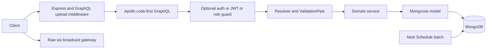

# Architecture and folder structure

## Stack observed

- TypeScript 5.9.3 installed/locked, requested `^5.1.3`; target ES2023, NodeNext modules and resolution, decorator metadata and experimental decorators.
- NestJS 10.4.22 core with Express HTTP adapter; Apollo Server 4.13.0 and Nest GraphQL/Apollo 12.2.2.
- MongoDB through Mongoose 8.24.2 and Nest Mongoose 10.1.0. No SQL ORM or migration tool.
- JWT via Nest JWT 10.2.0, bcryptjs 2.4.3; custom guards, no Passport strategy.
- class-validator/class-transformer through a global ValidationPipe.
- graphql-upload 13.0.0 middleware, local filesystem storage, UUID filenames.
- Native `ws` with Nest WsAdapter; Socket.IO dependency exists but is not the selected adapter.
- Nest Schedule 4.1.2 for cron; Jest 29/ts-jest/Supertest for scaffold tests.

Exact versions and declared ranges are in dependencies.md. These are local observations, not an assertion that versions are current upstream.

## Tree and ownership

```text
nestar/
  package.json / package-lock.json  one dependency graph and script set
  nest-cli.json                    two Nest application projects
  tsconfig*.json                   root compiler configuration
  eslint.config.mjs / .prettierrc  typed lint and formatting policy
  apps/
    nestar-api/
      src/
        main.ts                   HTTP bootstrap, pipes, uploads, WebSocket adapter
        app.*                     root HTTP/GraphQL endpoints and imports
        components/
          auth/                   JWT, password helpers, guards, decorators
          member/                 profiles, signup/login, uploads, admin members
          property/               listings, filters, ownership, favorites, visits
          board-article/          community content and moderation
          comment/                comments on members/properties/articles
          follow/                 subscriptions and relationship lists
          like/                   shared like toggle and favorites
          view/                   first-view records and visited properties
        database/                 MongoDB connection
        libs/
          dto/<domain>/           GraphQL input/output classes
          enums/                  persisted enum values + GraphQL registration
          interceptor/            logging
          types/                  dynamic dictionary and counter mutation type
          config.ts               sorts, filenames, ObjectId and lookup helpers
        schemas/                  nine Mongoose schema definitions
        socket/                   public broadcast gateway
      test/                       separate e2e config/test
    nestar-batch/
      src/
        batch.controller.ts       cron triggers and root HTTP handler
        batch.service.ts          Mongo rank calculations
        batch.module.ts           DB/models/scheduler wiring
        database/                 duplicated connection configuration
        lib/config.ts             job names (singular lib)
      test/                       separate e2e config/test
  uploads/                        ignored runtime content, publicly served
  dist/                           ignored build output
```

The API Nest project key is `nestar`, even though its directory is `nestar-api`; the batch key is `nestar-batch`. `nest build` targets the default API. Root `libs/`, package workspaces, Docker manifests, CI configuration, deployment manifests and existing project skills/context/AGENTS were not found in the reviewed file set.

## Request and dependency flow



ComponentsModule imports all eight domain modules. AuthModule provides AuthService and imports JWT plus an otherwise unused HttpModule. MemberModule consumes Auth, View and Like and registers Member/Follow models. Property and BoardArticle modules consume Member, View, Like and Auth. Comment consumes Member, Property, BoardArticle, View and Auth. Follow consumes Member and Auth. Like/View are lower-level services with their own models and no resolver. SocketModule only provides its gateway.

Batch imports API schemas, DTOs and enums directly through relative paths. There is no shared library boundary. Changing API schema defaults or enums also changes batch behavior. The two DatabaseModule implementations are duplicated rather than shared.

## Change locations

An API field normally touches `libs/dto`, its `schemas` definition, service and possibly resolver. An enum change also affects GraphQL registration, database values, filters and batch imports. A list filter belongs in the inquiry DTO and the service match builder, with sort allowlists in libs/config.ts. A new model needs MongooseModule.forFeature plus provider imports/exports. A batch formula lives in batch.service.ts; the schedule is separate in batch.controller.ts.

## Suggested structural improvements

These are proposals, not current conventions: extract persistence types/schemas into a shared Nest library; co-locate domain DTOs if navigation becomes costly; split upload handling out of MemberResolver; centralize environment validation and database configuration; move TotalCounter out of the member DTO; split public, self and administrative member contracts. Avoid a wholesale restructuring alongside unrelated behavior changes.
