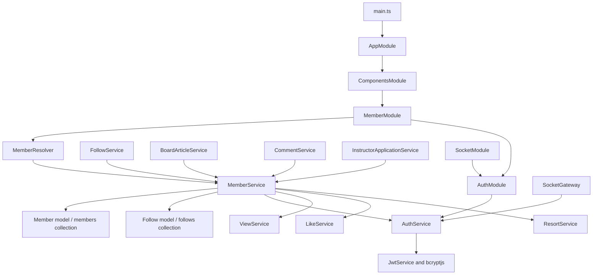

# Auth and member source audit

Audit date: 2026-10-08. Nestar was read only. `R/` below means `C:/Users/Aziz/Desktop/nestar/apps/nestar-api/src/`; `S/` means `apps/skiresort-api/src/`. Findings describe the current SkiResort working tree, including its pre-existing changes, rather than Git HEAD. This is an auth/member audit; other backend components are covered by the main review and domain audits.

## Per-file reading record

Each listed file was opened and read in full. Searches supplemented, but did not replace, reading these files.

| Relative path | Nestar | SkiResort | Evidence and decision |
| --- | --- | --- | --- |
| `components/auth/auth.module.ts` | Read | Read | `AuthModule`: HttpModule/JwtModule imports, AuthService provider/export, 30-day signing; already matches. |
| `components/auth/auth.service.ts` | Read | Read | `AuthService.hashPassword`, `comparePasswords`, `createToken`, `verifyAuth`; equivalent statements, already matches. |
| `components/auth/decorators/authMember.decorator.ts` | Read | Read | `AuthMember`: reads guard-populated `req.body.authMember`; already matches. |
| `components/auth/decorators/roles.decorator.ts` | Read | Read | `Roles`: `SetMetadata('roles', roles)`; already matches. |
| `components/auth/guards/auth.guard.ts` | Read | Read | `AuthGuard.canActivate`: JWT authentication, GraphQL context only; already matches. |
| `components/auth/guards/roles.guard.ts` | Read | Read | `RolesGuard.canActivate`: Reflector metadata plus JWT role; already matches. |
| `components/auth/guards/without.guard.ts` | Read | Read | `WithoutGuard.canActivate`: optional authentication; already matches. |
| `components/member/member.module.ts` | Read | Read | `MemberModule`: separate Member/Follow model registrations; S additionally imports ResortModule for an existing instructor requirement. |
| `components/member/member.resolver.ts` | Read | Read | `MemberResolver`: thin delegated GraphQL methods; S retains instructor operation and safe upload helper. |
| `components/member/member.service.ts` | Read | Read | `MemberService`: explicit public async methods, injected models/services, direct Mongoose queries; S role constraints and instructor workflow must remain. |
| `libs/dto/member/member.input.ts` | Read | Read | `MemberInput`, `LoginInput`, inquiry/search input classes; S InstructorSearch/InstructorsInquiry replace reference agent terminology. |
| `libs/dto/member/member.update.ts` | Read | Read | `MemberUpdate`: matching field decorators/validation and non-GraphQL `deleteAt` property. |
| `libs/dto/member/member.ts` | Read | Read | `Member`, `Members`, `TotalCounter`; S instructor fields extend the existing response contract. |
| `libs/dto/member/instructor-profile.update.ts` | No analogue/file | Read | `InstructorProfileUpdate`: retained typed, nullable instructor fields, transform/validation; no new class required. |
| `libs/enums/member.enum.ts` | Read | Read | `registerEnumType`; S INSTRUCTOR and instructor enums are domain contracts. |
| `schemas/Member.model.ts` | Read | Read | Raw `new Schema`, default export, timestamps and `members` collection; S instructor validation retained. |
| `components/member/member.service.spec.ts` | No corresponding file found | Read | Mocked signup/login, roles, allowlists, promotion, directory, profile association tests. |
| `components/member/member-upload.spec.ts` | No corresponding file found | Read | Temporary filesystem upload tests: destination creation, reserved events, failure cleanup, collision preservation, unsafe targets/MIME. |
| `libs/image-upload.ts` | No analogue/file | Read | Existing helper protects upload paths, owns exclusive destination, pipelines and cleans failure; do not replace with reference inline streams. |

Additional full reads: SkiResort and Nestar root `AGENTS.md`, `package.json`, `tsconfig.json`, `nest-cli.json`, API `tsconfig.app.json`; SkiResort `.prettierrc`; S `components/components.module.ts`, `components/follow/follow.module.ts`, `components/comment/comment.module.ts`, `components/board-article/board-article.module.ts`, `components/instructor-application/instructor-application.module.ts`, `components/resort/resort.module.ts`, `socket/socket.module.ts`. The auth skill and its historical trace were read; current source, not the historical trace, establishes findings.

Cross-module caller searches located S `FollowService.subscribe/unsubscribe`, `BoardArticleService.createBoardArticle/getBoardArticle/updateBoardArticle/updateBoardArticleByAdmin`, `CommentService.createComment`, `InstructorApplicationService.approveInstructorApplicationByAdmin`, and `SocketGateway` as described below. Their complete domain/service/test audits are tracked separately; this document does not claim those files were fully read by the auth/member reviewer. In particular, instructor-application resolver/integration tests also exercise MemberService/RolesGuard and belong to that component's audit. No reference app was run, formatted, installed into, or edited.

## Actual reference conventions and comparison

The closest analogue is the identically named Nestar component. It uses relative imports, a plain `@Resolver()` class, a readonly resolver service, explicit `public async` service methods with `Promise<DTO>`, and direct model calls. Its schema is a raw Mongoose `Schema`; there are no `@Schema`, `@Prop`, SchemaFactory, `@ResolveField`, mapped DTO types, or `forwardRef` in the reviewed auth/member files. Their absence is a finding about this component, not a claim about every reference component.

| SkiResort file | Exact Nestar reference | Current difference | Adjustment | Contract retained |
| --- | --- | --- | --- | --- |
| S `components/auth/**` | R matching paths; service methods at 13, 20, 24, 36 | Formatting/import order only; same guard/token/decorator implementation | Reviewed, no rewrite needed | Secret configuration, 30d expiry, guard errors, optional-auth semantics, JWT member shape |
| S `components/member/member.module.ts:12` | R `components/member/member.module.ts:11` | ResortModule dependency added to existing Nestar module shape | Retain; not an architectural mismatch | Service availability and Member/Follow model names |
| S `components/member/member.resolver.ts:27` | R `components/member/member.resolver.ts:20` | Instructors instead of agents; instructor profile mutation; uploads delegated to existing helper | Retain domain/security differences | All operation names, decorators, arguments, return types and guards |
| S `components/member/member.service.ts:52` | R `components/member/member.service.ts:32` | Signup explicitly rejects role values other than USER/undefined | Retain guard before try/hash/create | `NOT_ALLOWED_REQUEST` for ADMIN/INSTRUCTOR/null signup |
| S `components/member/member.service.ts:112` | R `components/member/member.service.ts:86` | Role check and general-profile allowlist instead of arbitrary input update | Retain security checks | Authenticated identity, ACTIVE match, accepted unchanged role, denied role escalation, fresh token |
| S `components/member/member.service.ts:212` | R `components/member/member.service.ts:153` (`getAgents`) | INSTRUCTOR match and additional follow lookup | Already same aggregation organization; retain follow lookup | Directory pagination/sort/text/likes/follows and `Members` response |
| S `components/member/member.service.ts:317` | R `components/member/member.service.ts:243` | Admin allowlist, validated roles, compare-and-set role update; instructor transitions forbidden | Retain security and workflow | Ordinary admin edits and USER/ADMIN changes remain; application is required for instructor promotion |
| S `components/member/member.service.ts:347`, `:384` | R service public async methods, model injection at 23, conditional updates at 86 | No instructor promotion/profile analogue | Retain nearest verified direct-model service form | Transaction, approval/member match, conditional ACTIVE USER promotion, visible Resort check, validation, null clearing, token refresh |
| S `libs/dto/member/member.input.ts` and `member.update.ts` | R matching paths/classes | Instructor domain names/sort allowlist; otherwise same construction | Reviewed, no rewrite needed | GraphQL required/nullable fields and validator decorators |
| S `libs/dto/member/member.ts:14` | R `libs/dto/member/member.ts:8` | Nullable instructor metadata/prices | Retain fields in Nestar object-type shape | Public response and all existing nullability |
| S `libs/dto/member/instructor-profile.update.ts:17` | R `libs/dto/member/member.update.ts:5` | Instructor-only fields use stricter enum/numeric/ID/language validation and transform | Already input-class style; retain all validation | Existing nullable/clearable profile contract |
| S `libs/enums/member.enum.ts` | R matching file | INSTRUCTOR replaces AGENT; added instructor enums | Reviewed, no rewrite needed | Persisted and GraphQL values |
| S `schemas/Member.model.ts:11` | R `schemas/Member.model.ts:5` | Instructor fields and validators | Already raw-schema style; retain every field/option/index | Existing records/collection/defaults and instructor data |

Do not normalize reference whitespace literally: the target formatter uses two-space indentation, single quotes and trailing commas; this does not change Nestar's coding organization.

## Wiring and request/dependency graph

`MemberModule` registers models named `Member` and `Follow`, provides MemberResolver/MemberService and exports MemberService. `AuthModule` imports HttpModule and configured JwtModule, provides/exports AuthService. ViewModule, LikeModule and ResortModule make the three existing injected services available. The resolver has `private readonly memberService`; the service has readonly `@InjectModel` model dependencies and private auth/view/like/resort service dependencies, matching R constructor conventions.

FollowModule imports MemberModule, but MemberModule registers FollowSchema directly instead of importing FollowModule. That is the same verified Nestar way of avoiding a cycle. BoardArticleModule, CommentModule and InstructorApplicationModule also import MemberModule and consume its exported service. ResortModule imports AuthModule, LikeModule and ViewModule but not MemberModule, so adding it to MemberModule does not introduce a module cycle. SocketModule imports AuthModule and its gateway verifies tokens through AuthService.

## GraphQL operation baseline

All listed GraphQL outputs and operation arguments are non-null by default in the reviewed decorators; individual input/output fields are detailed below. There are no member/auth REST controllers in these folders. Preserve the existing `chechAuth`/`chechAuthRoles` spelling.

| Kind/name | GraphQL arguments | Result | Guard/role | Service/delegation |
| --- | --- | --- | --- | --- |
| Mutation `signup` | `input: MemberInput!` | `Member!` | Public | `MemberService.signup` |
| Mutation `login` | `input: LoginInput!` | `Member!` | Public | `MemberService.login` |
| Query `chechAuth` | None | `String!` | AuthGuard | AuthMember(memberNick), greeting |
| Query `chechAuthRoles` | None | `String!` | AuthGuard and RolesGuard; INSTRUCTOR or USER | AuthMember(), greeting |
| Mutation `updateMember` | `input: MemberUpdate!` | `Member!` | AuthGuard | Delete client `_id`, pass AuthMember(_id) to `updateMember` |
| Query `getMember` | `memberId: String!` | `Member!` | WithoutGuard | Convert target ID, call `getMember(viewerId, targetId)` |
| Query `getInstructors` | `input: InstructorsInquiry!` | `Members!` | WithoutGuard | `getInstructors(viewerId, input)` |
| Mutation `likeTargetMember` | `memberId: String!` | `Member!` | AuthGuard | Convert target ID, `likeTargetMember(viewerId, targetId)` |
| Mutation `updateInstructorProfile` | `input: InstructorProfileUpdate!` | `Member!` | RolesGuard; INSTRUCTOR | `updateInstructorProfile(AuthMember(_id), input)` |
| Query `getAllMembersByAdmin` | `input: MembersInquiry!` | `Members!` | RolesGuard; ADMIN | `getAllMembersByAdmin(input)` |
| Mutation `updateMemberByAdmin` | `input: MemberUpdate!` | `Member!` | RolesGuard; ADMIN | `updateMemberByAdmin(input)` |
| Mutation `imageUploader` | `file: Upload!`, `target: String!` | `String!` | AuthGuard | `assertGenericUploadTarget`, `saveImageUpload` |
| Mutation `imagesUploader` | `files: [Upload!]!`, `target: String!` | `[String!]!` | AuthGuard | Same helpers; concurrent per-file work with existing swallowed per-file failures |

Guards do not query current account eligibility: AuthService verifies token signature/expiry and converts `_id`; AuthGuard populates request.body.authMember; RolesGuard checks handler `roles` metadata against token memberType. Missing token is `TOKEN_NOT_EXIST`; denied role is `ONLY_SPECIFIC_ROLES_ALLOWED`. WithoutGuard sets authMember null for missing/invalid token and permits anonymous access. AuthMember returns the member or named property, null when absent, and copies the authorization header onto an existing GraphQL authMember.

## DTO, enum and persisted contracts

- `MemberInput`: required String memberNick/password (IsNotEmpty, Length 3..12), required String memberPhone (IsNotEmpty); nullable optional MemberType/memberAuthType. Service permits only USER/undefined for memberType. `LoginInput` has the two required length-constrained Strings. No input defaults are declared.
- `InstructorsInquiry`/`MembersInquiry`: required Int page/limit, IsNotEmpty/Min(1); optional nullable String sort with IsIn(availableInstructorSorts/availableMemberSorts); nullable Direction direction; required nested search object. InstructorSearch has nullable optional text; MISearch adds nullable optional memberStatus/memberType. Do not invent additional nested validation or pagination bounds.
- `MemberUpdate`: required GraphQL String `_id` despite TypeScript optional property; nullable optional memberType/status/phone/nick/password/fullName/image/address/desc. Nick/password length 3..12, fullName length 3..100. `deleteAt` lacks a Field decorator and is not a GraphQL input. The self resolver removes `_id` after validation.
- `InstructorProfileUpdate`: every field nullable/optional, with no defaults. resortId String/IsMongoId; experience Int/IsInt/Min(0); languages list of String, array/string-per-element/nonblank validation and trimming transform; level/audience IsEnum; four Float prices IsNumber(finite)/Min(0). Service independently trims language strings and validates a non-null visible resort; explicit null clears values.
- `Member`: required String `_id`, memberPhone/nick/image; required MemberType/Status/AuthType; nullable String fullName/address/desc; password has no Field and is not GraphQL-selectable. Instructor resort ID String, experience Int, languages [String], level/audience enums, four Float prices are nullable. Properties/articles/followers/followings/points/likes/views/comments/rank/warnings/blocks are required Ints. deletedAt nullable Date; createdAt/updatedAt non-null Date; accessToken nullable String; meLiked/meFollowed nullable arrays. `Members.list` is a required Member array; `metaCounter` nullable TotalCounter array; TotalCounter.total nullable Int.
- Enum values: MemberType USER/INSTRUCTOR/ADMIN; MemberStatus ACTIVE/BLOCK/DELETE; MemberAuthType PHONE/EMAIL/TELEGRAPH; InstructorLevel BEGINNER/INTERMEDIATE/ADVANCED/ALL; InstructorAudience KIDS/ADULTS/FAMILY/PRIVATE. Each uses `registerEnumType` with its existing GraphQL name.
- `MemberSchema`: timestamps true, collection `members`; type/status/auth defaults USER/ACTIVE/PHONE; phone/nick required unique sparse String indexes; password required String select:false; image default empty String; optional fullName/address/desc; eleven counters default 0; optional deletedAt Date. Instructor resort reference is ObjectId/ref Resort/default null; experience null/min0/integer validator; languages [String]/null/nonblank validator; level/audience String enums/null; four prices Number/null/min0/finite validator. `_id` and timestamps use Mongoose behavior; no new persistence schema/index/collection is needed.

## Method-by-method request walkthrough

`MemberResolver` mirrors R: decorators expose names/types, `Args` reads client data, guards establish identity/role, AuthMember reads that identity, the resolver converts IDs where already implemented, and one service call handles the domain work. `@Injectable` lets Nest construct services; `@InjectModel('Member')` resolves the model registered by MemberModule. DTO `Field` declarations control GraphQL visibility separately from persisted schema fields and class-validator input rules.

1. CREATE: `signup` first rejects disallowed memberType before hashing. Within the existing try/catch it hashes through AuthService, creates Member, signs a password-free member payload, assigns accessToken and returns Member. Any error inside that block becomes `USED_MEMBER_NICK_OR_PHONE`. The early role error retains `NOT_ALLOWED_REQUEST` instead. R performs hash/create/token the same way but lacks the role restriction.
2. Authentication READ: `login` finds memberNick, explicitly selects the normally hidden password, rejects absent/DELETE members with `NO_MEMBER_NICK`, BLOCK with `BLOCKED_USER`, compares bcrypt password and rejects mismatch with `WRONG_PASSWORD`. It creates accessToken and returns Member. Existing catch wraps failures in BadRequestException. Token creation does not add a stored password to the GraphQL schema.
3. Self UPDATE: resolver deletes input._id and passes authenticated ID. If memberType was supplied, `updateMember` reads the ACTIVE account and rejects a changed role. `generalProfileFields` copies only the existing eight general fields, omitting undefined values. Conditional update requires authenticated `_id` and ACTIVE; absent result is `UPDATE_FAILED`. The updated member receives a new token. These role/field restrictions cannot be dropped to mimic R's direct update(input).
4. Member READ: `getMember` searches target `_id` with status ACTIVE or BLOCK; missing is `NO_DATA_FOUND`. For authenticated viewers, ViewService.recordView creates/deduplicates a MEMBER view; only a newly recorded view increments persisted/in-memory memberViews. LikeService.checkLikeExistence decorates meLiked. Private `checkSubscription` reads the registered Follow model for follower/following and returns one MeFollowed or an empty list. Anonymous reads omit these interactions. R uses the same sequence.
5. Directory READ: `getInstructors` matches ACTIVE INSTRUCTOR, optional case-insensitive nick regex, requested sort/direction (createdAt/DESC fallback). Aggregation `$facet` has paginated list with like and follow lookups plus total counter. Empty aggregation result is `NO_DATA_FOUND`; otherwise first facet result is returned. Keep follow lookup even for anonymous viewers as the existing tests require.
6. Like UPDATE: `likeTargetMember` requires an ACTIVE target, builds MEMBER LikeInput, asks LikeService.toggleLike for +1/-1, and calls memberStatsEditor to `$inc` memberLikes. Missing target is `NO_DATA_FOUND`, failed result `SOMETHING_WENT_WRONG`; direct stats update has its existing `memberStatsEditor error`. R uses the same composed services.
7. Admin READ/UPDATE: list filters supplied status/type/text, sorts/paginates in a facet and returns first result. Admin update builds `_id` match and general-profile allowlist, verifies any supplied role/current target; a changed instructor role in either direction is forbidden; USER/ADMIN reassignment includes old memberType in the update match. Missing target/update is `UPDATE_FAILED`. It does not refresh a token. Keep these differences from R.
8. Instructor transition: `promoteMemberToInstructor` is an internal exported-service method, not a GraphQL operation. It requires session.inTransaction(), APPROVED application and matching member ID; update requires ACTIVE USER, sets only role and approved instructor snapshot, uses session/runValidators. A failed conditional match is ConflictException `Only an active USER can be approved`. It deliberately leaves general biography/prices untouched. `InstructorApplicationService.approveInstructorApplicationByAdmin` calls it at S service line 228 while approving in its transaction.
9. Instructor UPDATE: `updateInstructorProfile` copies the nine permitted instructor fields only; optional resort ID is validated and checked through ResortService.assertVisibleResort; languages trim; update requires ACTIVE INSTRUCTOR and runValidators, failing with `ONLY_SPECIFIC_ROLES_ALLOWED`. Null values clear fields; undefined omits them. Result receives refreshed token. ResortService dependency is provided by ResortModule import, not duplicated model logic.
10. DELETE: no member deletion operation exists. The existing general memberStatus field can represent DELETE; login rejects DELETE and public member search omits it. Do not add a delete route or alter this behavior.
11. Uploads: imageUploader reserves events for the existing admin Event upload operation, checks filename/MIME and safe directory target through the helper, creates directory, exclusively opens destination and awaits pipeline. Failure closes/unlinks owned partial file and propagates real error. imagesUploader retains array-index placement and swallowed individual failures. Nestar's inline piping is less safe and must not replace these existing protections.

Cross-feature reuse: FollowService reads targets without view side effects (`getMember(null, followingId)`) and increments followers/followings; BoardArticleService adjusts memberArticles and retrieves article memberData through getMember; CommentService adjusts memberComments; InstructorApplicationService performs the approved transactional promotion. Existing method signatures/export availability and side effects are therefore part of compatibility.

## Risks and intentionally unmodified defects

These are source-confirmed current behaviors, not claims about actual deployment settings or incidents:

- S resolver lines 33/39 log signup/login inputs containing passwords; signup service line 68 logs the created member/token; AuthGuard line 20 logs request headers including bearer tokens; AuthService line 30 logs member payload. The equivalent reference logs also exist. Removing/redacting logs is a separate security repair; report it rather than silently changing this style-only batch.
- `generalProfileFields` includes memberPassword (S service line 435), and self/admin updates pass it to Mongoose without hashPassword. A supplied replacement password is stored directly. The reference also writes directly. Fix requires an explicit behavior/security decision; no plaintext credential writes are introduced by this audit.
- RolesGuard uses the JWT's memberType and AuthService.verifyAuth does not query current status/type. Previously issued credentials may remain authorized after account/role changes until expiry. The instructor profile/promotion paths add database conditions, but that does not change every other guard consumer. Current-account revocation policy remains unchanged.
- Member publicly exposes memberPhone/address, including anonymous getMember and nested outputs. Password lacks Field, but schema select:false alone does not redact aggregation/JWT/logs. Altering public privacy requires a contract decision.
- AuthModule interpolates process.env.SECRET_TOKEN; missing secret can become string `undefined`. No secret or environment value was read. Fail-fast/reconfiguration is outside the style-only batch.
- AuthService.comparePasswords declares Promise<string>, matching Nestar, while bcrypt compares to a boolean at runtime. Current noImplicitAny/bcrypt declarations permit this; do not use this annotation as evidence the runtime returns String.
- Do not change optional auth, guard/decorator order, role restrictions, generic-upload protections, instructor transaction, schema validators, or directory follow lookups to imitate unsafe/absent reference behavior.

## Verification and safe batch disposition

Baseline focused command attempted: `npm test -- --runInBand --runTestsByPath apps/skiresort-api/src/components/member/member.service.spec.ts apps/skiresort-api/src/components/member/member-upload.spec.ts`. It failed before tests could execute because `npm` is not on this session's PowerShell PATH. This is **not a test failure** and not a refactor regression. The root reviewer subsequently located an existing Node executable and reported API and batch no-emit baseline TypeScript checks passed. Root's complete baseline Jest run, with an empty `SKIRESORT_TEST_MONGO_URI` to prevent database access, passed 31 suites and 548 tests; one suite and seven tests were skipped. This includes the existing member/upload tests and is a baseline result, not proof of a new auth/member source edit. No Nestar checks were run. Integration tests/bootstrapping requiring a real database are not run by this audit.

Auth and member are **reviewed with no necessary structural rewrite** at this audit point. They already demonstrate the reference's module/resolver/service/DTO/raw-schema pattern. Safe future cleanup could consolidate duplicate import declarations inside MemberService, but that alone does not justify claiming a substantive component refactor. Any later change requires the main audit barrier/migration map and contract verification. Existing user edits/untracked files remain intact.
