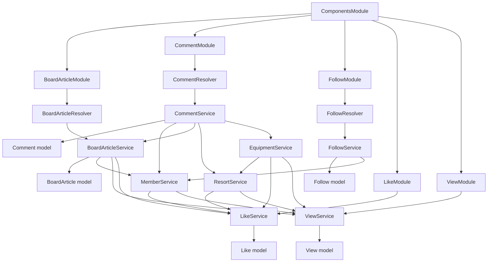

# Board articles, comments, follows, likes, and views

Audit date: 2026-10-08. This review reads the current SkiResort working tree as the behavioral baseline, including existing uncommitted changes. Nestar was read only. This document covers the five assigned feature groups; it does not claim that the rest of either backend has been fully inspected by this reviewer.

The result is **reviewed, no source rewrite required** for this group. The existing organization, decorators, model registration, constructor injection, thin resolvers, direct model calls, pagination, and shared-service calls already follow the corresponding Nestar components. SkiResort's additional validation, visibility checks, duplicate handling, and compensation are existing behavior and must survive. Removing them to copy the shorter reference would violate the preservation rules.

## Per-file source review inventory

`S/` means `apps/skiresort-api/src/` in SkiResort. `N/` means `C:/Users/Aziz/Desktop/nestar/apps/nestar-api/src/`. Each row below represents **two separate files**, both opened and read in full, including imports and every method. Line references identify useful starting points rather than the extent of the read.

| Relative path under S/ and N/ | SkiResort evidence | Nestar evidence | Review result |
| --- | --- | --- | --- |
| `components/board-article/board-article.module.ts` | `BoardArticleModule`, line 11 | same class, line 11 | Full read; matching imports/providers/export pattern |
| `components/board-article/board-article.resolver.ts` | `BoardArticleResolver`, line 23 | same class, line 16 | Full read; matching operations, guards, delegation |
| `components/board-article/board-article.service.ts` | `BoardArticleService`, line 34 | same class, line 18 | Full read; matching CRUD/counter/list flow; retain group-aware lookup |
| `libs/dto/board-article/board-article.input.ts` | `BoardArticleInput`, `BoardArticlesInquiry`, `AllBoardArticlesInquiry`, lines 11/49/86 | lines 8/46/83 | Full read; matching construction and validation |
| `libs/dto/board-article/board-article.update.ts` | `BoardArticleUpdate`, line 6 | line 6 | Full read; matching fields/validation |
| `libs/dto/board-article/board-article.ts` | `BoardArticle`, `BoardArticles`, lines 10/57 | lines 7/56 | Full read; matching output shape/nullability |
| `libs/enums/board-article.enum.ts` | category/status, lines 3/15 | lines 3/13 | Full read; retain SkiResort categories |
| `schemas/BoardArticle.model.ts` | `BoardArticleSchema`, line 7 | line 4 | Full read; matching fields/options |
| `components/comment/comment.module.ts` | `CommentModule`, line 12 | line 13 | Full read; domain service imports follow reference |
| `components/comment/comment.resolver.ts` | `CommentResolver`, line 23 | line 17 | Full read; retain validated IDs |
| `components/comment/comment.service.ts` | `CommentService`, line 25 | line 16 | Full read; retain validation/visibility/compensation and SkiResort groups |
| `libs/dto/comment/comment.input.ts` | `CommentInput`, `CISearch`, `CommentsInquiry`, lines 19/39/52 | lines 8/26/33 | Full read; retain stronger validation and optional group filter |
| `libs/dto/comment/comment.update.ts` | `CommentUpdate`, line 6 | line 6 | Full read; matching owner-update input |
| `libs/dto/comment/comment.ts` | `Comment`, `Comments`, lines 6/38 | lines 6/38 | Full read; matching output shape |
| `libs/enums/comment.enum.ts` | `CommentStatus`, `CommentGroup`, lines 3/11 | lines 3/11 | Full read; retain RESORT/EQUIPMENT rather than PROPERTY |
| `schemas/Comment.model.ts` | `CommentSchema`, line 4 | line 4 | Full read; matching fields/options |
| `components/follow/follow.module.ts` | `FollowModule`, line 9 | line 9 | Full read; matching registration/imports/providers/export |
| `components/follow/follow.resolver.ts` | `FollowResolver`, line 12 | line 12 | Full read; matching operations/guards/IDs |
| `components/follow/follow.service.ts` | `FollowService`, line 26 | line 12 | Full read; retain idempotent registration |
| `libs/dto/follow/follow.input.ts` | `FollowSearch`, `FollowInquiry`, lines 5/16 | lines 5/16 | Full read; matching fields/validation |
| `libs/dto/follow/follow.ts` | `MeFollowed`, `Follower`, `Following`, `Followings`, `Followers`, lines 6/18/47/76/85 | same line positions | Full read; matching fields/nullability |
| `schemas/Follow.model.ts` | `FollowSchema`, line 3; index line 18 | same line positions | Full read; matching unique pair and timestamps |
| `components/like/like.module.ts` | `LikeModule`, line 6 | line 6 | Full read; matching exported shared service |
| `components/like/like.service.ts` | `LikeService`, line 23 | line 14 | Full read; retain group discrimination, duplicate handling, undo, history filtering |
| `libs/dto/like/like.input.ts` | `LikeInput`, line 6 | line 6 | Full read; matching DTO pattern |
| `libs/dto/like/like.ts` | `MeLiked`, `Like`, lines 5/17 | lines 5/17 | Full read; matching fields/nullability |
| `libs/enums/like.enum.ts` | `LikeGroup`, line 3 | line 3 | Full read; retain SkiResort groups |
| `schemas/Like.model.ts` | `LikeSchema`, line 4; index line 26 | same line positions | Full read; retain LikeGroup instead of reference ViewGroup |
| `components/view/view.module.ts` | `ViewModule`, line 6 | line 6 | Full read; matching exported shared service |
| `components/view/view.service.ts` | `ViewService`, line 24 | line 14 | Full read; retain group discrimination, duplicate handling, undo, history filtering |
| `libs/dto/view/view.input.ts` | `ViewInput`, line 6 | line 6 | Full read; matching DTO pattern |
| `libs/dto/view/view.ts` | `View`, line 5 | line 6 | Full read; matching GraphQL scalars/nullability |
| `libs/enums/view.enum.ts` | `ViewGroup`, line 3 | line 3 | Full read; retain SkiResort groups |
| `schemas/View.model.ts` | `ViewSchema`, line 4; index line 26 | same line positions | Full read; matching persisted fields/index |

This is 34 authored feature files per project, 68 feature-source reads. No follow enum exists in either tree; no like/view resolver or controller exists in either tree. There is no BoardArticle test in the inspected feature/DTO/schema folders. A directory search found no nested `AGENTS.md` under either backend `src`.

Additional full reads: `S/libs/config.ts`, `N/libs/config.ts`, both `libs/types/common.ts`, both `libs/enums/common.enum.ts`, and `S/components/{member,resort,equipment}/*.module.ts` (the three named module files). Imported helpers and counter interfaces were traced directly. Existing root `package.json` and `apps/skiresort-api/tsconfig.app.json` were read to establish available non-mutating checks; root configuration and bootstrap ownership belong to the main audit.

The following extra files were searched and selected methods were read to trace consumers; they are **not claimed as full reads in this document**: SkiResort `components/member/member.service.ts` (`getMember`, `likeTargetMember`), `components/resort/resort.service.ts` (`getResort`, history delegation, `likeTargetResort`, compensation), `components/equipment/equipment.service.ts` (`getEquipment`, history delegation, `likeTargetEquipment`, `assertVisibleEquipment`, `commentRemoved`); Nestar `components/property/property.service.ts` (`getProperty`, `propertyStatsEditor`, `getFavorites`, `getVisited`, `likeTargetProperty`) and `components/member/member.service.ts` (`getMember`, `likeTargetMember`). Their full reviews are tracked by the reviewers assigned to those components.

The four assigned tests were read in full: `S/components/comment/comment.service.spec.ts` (347 lines), `follow/follow.service.spec.ts` (99), `like/like.service.spec.ts` (176), and `view/view.service.spec.ts` (137). They use model/service mocks and require no database. Whole-backend verification results belong to the main plan; this reviewer did not start a duplicate test process.

## Verified Nestar conventions and comparison map

The closest analogues are the same named Nestar components; resort/equipment favorite and visit paths use Nestar Property as their nearest structural analogue. Reference formatting varies considerably between files. Whitespace and import-order differences do not establish a reason to rewrite matching implementations.

| SkiResort file/group | Exact Nestar reference/pattern | Difference | Intended adjustment | Behavior kept |
| --- | --- | --- | --- | --- |
| `S/components/board-article/board-article.module.ts` | `N/components/board-article/board-article.module.ts`, `MongooseModule.forFeature`, providers, exported service | Formatting/import order | None; already matching | BoardArticle token, imported service modules, exported counter editor |
| BoardArticle resolver/service and three DTO files | same relative Nestar files and method names | Formatting, Ski category values, group-aware `lookupAuthMemberLiked` | None; already matching | All eight operation names/types/guards; owner ACTIVE filter; sorting/pagination/errors |
| `S/schemas/BoardArticle.model.ts` and board enum | same Nestar paths | Ski category values | None | Collection `boardArticles`, all fields/defaults, timestamps |
| `S/components/comment/comment.module.ts` | `N/components/comment/comment.module.ts` | Resort/Equipment replace Property consumers; unused reference View import absent | None | Injected exported domain services; no service export, no cycle |
| Comment resolver and inputs | same Nestar paths | `validateMongoObjectId`, `IsEnum`, `IsMongoId`, `IsInt`, nested transformation, optional group | None; security/contract differences preserved | Invalid-input errors; search group nullability; no client memberId field |
| Comment service | `N/components/comment/comment.service.ts`, `createComment` switch, owner update, facet list | Ski visibility checks, compensation, supported-group filtering and active-target removal counters | None; behavior conflict prevents literal copy | Exact compensation predicates/timestamps, errors, owner checks, removal lifecycle |
| Follow resolver/module/DTO/schema | same Nestar paths | Formatting | None; already matching | subscribe/unsubscribe/follow lists, String IDs, unique index |
| `S/components/follow/follow.service.ts` | `N/components/follow/follow.service.ts`, private `registerSubscription` | Duplicate create returns existing follow and does not increment counters | None | Idempotency, self denial, target lookup, missing unsubscribe error |
| `S/components/like/like.service.ts` | `N/components/like/like.service.ts`, shared model service, toggle/existence and favorite aggregation | Group discriminator, atomic removal, WithChange/undo, resort/equipment histories | None; business/safety differences preserved | Modifier 1/-1/0, exact-record undo, all history filters/ordering/output normalization |
| `S/components/view/view.service.ts` | `N/components/view/view.service.ts`, exported recording/history service | Group discriminator, WithChange/undo, duplicate handling, resort/equipment histories | None; business/safety differences preserved | New record or null; exact-record undo; histories and stable sort |
| Like/View DTO, enums and schemas | same Nestar paths | Ski groups; Like schema correctly references LikeGroup | None | GraphQL scalars/nullability, existing collections and pair-only indexes |

All five modules use `@Module` with `MongooseModule.forFeature`; all five services use `@Injectable` and `@InjectModel`. Resolver constructors inject a `private readonly` service. Service constructors make the model `private readonly`; reference service dependency access differs: BoardArticle/Follow use `private`, Comment uses `private readonly`. SkiResort already follows those exact counterparts.

The resolvers use `@Resolver()`, `@Query`, `@Mutation`, `@Args`, `@AuthMember('_id')`, `@UseGuards`, and admin `@Roles`. Their bodies log the operation, normalize IDs where appropriate, and delegate to a service. The inspected social files use no REST controller, `@ResolveField`, `@Context`, `@ArgsType`, `@ID`, `@Schema`, `@Prop`, `SchemaFactory`, `populate`, mapped input types, or `forwardRef`. The schema files construct and default-export `new Schema(...)`; model types use output DTOs. Do not introduce those absent decorators/features to perform this refactor.

## Dependency and request graph

`CommentService` is reused across domain targets through its own public comment operations. Domain services do **not** inject CommentService. CommentModule imports MemberModule, BoardArticleModule, ResortModule, and EquipmentModule to use their exported services and update their counters. This is the same direction as Nestar CommentModule importing PropertyModule/MemberModule/BoardArticleModule. Search found no outside CommentService caller. LikeModule/ViewModule export their services for Member, BoardArticle, Resort, and Equipment. FollowModule exports FollowService, but no other feature currently injects it; Member registers its own Follow model for subscription checks, as in the reference.

These edges are acyclic without `forwardRef`. Like/View services refer to resort/equipment DTOs and perform collection lookups; they do not inject those domain services or import their modules.

## Public operations, arguments, guards, and errors

All listed GraphQL arguments and operation return values are non-null; these decorators specify no argument default. IDs are GraphQL `String`, not `ID`. `AuthMember` extracts the authenticated context ID, not a client-provided argument. `WithoutGuard` remains on public queries and `AuthGuard` on member mutations. Admin methods keep RolesGuard plus ADMIN metadata. The actual guards are audited separately; this review verifies their presence and delegation.

| Resolver method / GraphQL operation | Argument -> result | Guard | Service/model behavior |
| --- | --- | --- | --- |
| `BoardArticleResolver.createBoardArticle` | `input: BoardArticleInput!` -> `BoardArticle!` | AuthGuard | create with caller memberId; increment caller memberArticles; caught error -> BadRequest CREATE_FAILED |
| `getBoardArticle` | `articleId: String!` -> `BoardArticle!` | WithoutGuard | find ACTIVE, NO_DATA_FOUND if absent; signed-in first view and like flag; fetch owner |
| `updateBoardArticle` | `input: BoardArticleUpdate!` -> `BoardArticle!` | AuthGuard | owner + ACTIVE findOneAndUpdate/new; UPDATE_FAILED on no match; DELETE decrements memberArticles |
| `getBoardArticles` | `input: BoardArticlesInquiry!` -> `BoardArticles!` | WithoutGuard | ACTIVE plus category/title regex/member filters; sort/facet; likes and owner join |
| `likeTargetBoardArticle` | `articleId: String!` -> `BoardArticle!` | AuthGuard | require ACTIVE target; toggle ARTICLE like; increment articleLikes by returned modifier |
| `getAllBoardArticlesByAdmin` | `input: AllBoardArticlesInquiry!` -> `BoardArticles!` | RolesGuard, ADMIN | optional status/category; sorted paged owner join |
| `updateBoardArticleByAdmin` | `input: BoardArticleUpdate!` -> `BoardArticle!` | RolesGuard, ADMIN | ACTIVE target, no owner filter; DELETE decrements result owner's articles |
| `removeBoardArticleByAdmin` | `articleId: String!` -> `BoardArticle!` | RolesGuard, ADMIN | physical deletion requires DELETE status; REMOVE_FAILED on no match |
| `CommentResolver.createComment` | `input: CommentInput!` -> `Comment!` | AuthGuard | validated group/ID; visibility for resort/equipment; create then target counter |
| `updateComment` | `input: CommentUpdate!` -> `Comment!` | AuthGuard | owner + ACTIVE update/new; UPDATE_FAILED on no match; no counter decrement |
| `getComments` | `input: CommentsInquiry!` -> `Comments!` | WithoutGuard | validated target ID; ACTIVE and selected/all-supported groups; sorted facet with owner join |
| `removeCommentByAdmin` | `commentId: String!` -> `Comment!` | RolesGuard, ADMIN | physically remove supported group; active resort/equipment target decrement, compensation on failure |
| `FollowResolver.subscribe` | `input: String!` -> `Follower!` | AuthGuard | self denial; target member lookup; create or return duplicate; counters only on insert |
| `unsubscribe` | `input: String!` -> `Follower!` | AuthGuard | target lookup; remove exact pair; NO_DATA_FOUND if absent; decrement both counters |
| `getMemberFollowings` | `input: FollowInquiry!` -> `Followings!` | WithoutGuard | normalize followerId; require it; createdAt DESC facet, member/like/follow joins |
| `getMemberFollowers` | `input: FollowInquiry!` -> `Followers!` | WithoutGuard | normalize followingId; require it; symmetric follower joins |

`LikeService` and `ViewService` have no direct GraphQL/REST endpoint. `ResortService.getFavoriteResorts/getVisitedResorts` and `EquipmentService.getFavoriteEquipments/getVisitedEquipments` delegate to their history methods. Resort and Equipment authenticated detail/like paths use `recordViewWithChange/toggleLikeWithChange`; Member and BoardArticle use the compatible `recordView/toggleLike` wrappers. Preserve both APIs and all existing consumers.

Except the explicit CREATE_FAILED BadRequest catches and validated-ID BadRequest errors, missing article/comment/follow records use `InternalServerErrorException` with existing Message values (`No data found!`, `Update failed!`, `Remove failed!`, `Self subscription is denied!`, `Bad Request`). `boardArticleStatsEditor` retains its literal `boardstats error`. Service group validation uses BadRequest `Bad Request`. Like/View persistence failures use BadRequest `Create failed!`. Resort/equipment counter and visibility errors are propagated unchanged.

## Input and output contract inventory

Notation: `!` means GraphQL non-null; `?` means a nullable field; `hidden` means there is no `@Field`, so it is not supplied through GraphQL. Runtime database defaults are documented separately. Definite-assignment `!` in TypeScript is only a compiler promise and does not assign a runtime value.

| Class | Fields and existing validation |
| --- | --- |
| `BoardArticleInput` | `articleCategory: BoardArticleCategory!` (IsNotEmpty), `articleTitle: String!` (IsNotEmpty, Length 3..50), `articleContent: String!` (IsNotEmpty, Length 3..250), `articleImage: String?` (IsOptional), `memberId: ObjectId` hidden/server-assigned |
| `BAISearch` | `articleCategory: BoardArticleCategory?`, `text: String?`, `memberId: String?`; all IsOptional |
| `BoardArticlesInquiry` | `page: Int!`, `limit: Int!` (IsNotEmpty, Min 1); `sort: String?` (IsOptional, IsIn createdAt/updatedAt/articleLikes/articleViews); `direction: Direction?` (IsOptional); `search: BAISearch!` (IsNotEmpty) |
| `ABAISearch` | `articleStatus: BoardArticleStatus?`, `articleCategory: BoardArticleCategory?`; IsOptional |
| `AllBoardArticlesInquiry` | same page/limit/sort/direction validation as public inquiry; `search: ABAISearch!` |
| `BoardArticleUpdate` | `_id: String!` (IsNotEmpty); `articleStatus: BoardArticleStatus?`; `articleTitle: String?` (Length 3..50); `articleContent: String?` (Length 3..250); `articleImage: String?`; optional fields IsOptional |
| `CommentInput` | `commentGroup: CommentGroup!` (IsNotEmpty, IsEnum); `commentContent: String!` (IsNotEmpty, Length 1..100); `commentRefId: String!` (IsNotEmpty, IsMongoId); `memberId` hidden/server-assigned |
| `CISearch` | `commentRefId: String!` (IsNotEmpty, IsMongoId); `commentGroup: CommentGroup?` (IsOptional, IsEnum) |
| `CommentsInquiry` | page/limit `Int!` (IsNotEmpty, IsInt, Min 1); sort `String?` (IsOptional, IsIn createdAt/updatedAt); direction `Direction?` (IsOptional, IsEnum); search `CISearch!` (IsNotEmpty, ValidateNested, Type(CISearch)) |
| `CommentUpdate` | `_id: String!` (IsNotEmpty); `commentStatus: CommentStatus?` (IsOptional); `commentContent: String?` (IsOptional, Length 1..100) |
| `FollowSearch` | `followingId: String?`, `followerId: String?`; IsOptional |
| `FollowInquiry` | page/limit `Int!` (IsNotEmpty, Min 1); search `FollowSearch!` (IsNotEmpty); service enforces the appropriate ID |
| `LikeInput` | memberId/likeRefId `String!`, likeGroup `LikeGroup!`; IsNotEmpty on each; used internally by domain services |
| `ViewInput` | memberId/viewRefId `String!`, viewGroup `ViewGroup!`; IsNotEmpty on each; used internally by domain services |

None of these input `@Field` declarations has a default value. Public/article/comment sorts default **in service code** to createdAt and Direction.DESC; Follow always uses createdAt DESC. Preserve the current distinction between GraphQL enum validation and explicit class-validator decorators; do not add or remove validators as a style change.

| Output class | GraphQL fields |
| --- | --- |
| `BoardArticle` | `_id: String!`; articleCategory/category enum and articleStatus/status enum non-null; articleTitle/articleContent `String!`; articleImage `String?`; articleViews/articleLikes/articleComments `Int!`; memberId `String!`; createdAt/updatedAt `DateTime!`; memberData `Member?`; meLiked `[MeLiked!]?` |
| `BoardArticles` | list `[BoardArticle!]!`; metaCounter `[TotalCounter!]?` |
| `Comment` | `_id`, commentContent, commentRefId, memberId `String!`; commentStatus/group enums non-null; createdAt/updatedAt `DateTime!`; memberData `Member?` |
| `Comments` | list `[Comment!]!`; metaCounter `[TotalCounter!]?` |
| `MeFollowed` | followingId/followerId `String!`; myFollowing `Boolean!` |
| `Follower` / `Following` | `_id`, followingId, followerId `String!`; createdAt/updatedAt `DateTime!`; meLiked `[MeLiked!]?`; meFollowed `[MeFollowed!]?`; Follower has followerData `Member?`, Following has followingData `Member?` |
| `Followings` / `Followers` | list `[Following!]!` / `[Follower!]!`; metaCounter `[TotalCounter!]?` |
| `MeLiked` | memberId/likeRefId `String!`; myFavorite `Boolean!` |
| `Like` | `_id`, likeRefId, memberId `String!`; likeGroup `LikeGroup!`; createdAt/updatedAt `DateTime!` |
| `View` | `_id`, viewGroup, viewRefId, memberId `String!`; deletedAt `DateTime?`; createdAt/updatedAt `DateTime!` although their TypeScript declarations are optional |

`View.viewGroup` is intentionally a String output field, just as in Nestar, while ViewInput uses the registered enum. `View.deletedAt` is an output-only nullable field; the persisted View schema does not define it. Neither difference is a reason to change this public contract.

## Persisted fields, enums, options, and indexes

All five schemas use default Mongo `_id`, Mongoose `__v`, and `{ timestamps: true }`, and retain their explicit collection names. No schema field is renamed or deleted. Validation/decorator classes are separate from persisted schemas; an input DTO is not a database schema.

| Model / collection | Authored schema fields and options | Index |
| --- | --- | --- |
| BoardArticle / `boardArticles` | articleCategory String enum required; articleStatus String enum default ACTIVE; articleTitle/content String required; articleImage optional String; articleLikes/views/comments Number default 0; memberId ObjectId required, ref Member | no authored extra index |
| Comment / `comments` | commentStatus String enum default ACTIVE; commentGroup String enum required; commentContent String required; commentRefId/memberId ObjectId required | no authored extra index |
| Follow / `follows` | followingId/followerId ObjectId required | `{ followingId: 1, followerId: 1 }`, unique |
| Like / `likes` | likeGroup String enum LikeGroup required; likeRefId ObjectId required; memberId ObjectId required, ref Member | `{ memberId: 1, likeRefId: 1 }`, unique |
| View / `views` | viewGroup String enum ViewGroup required; viewRefId ObjectId required; memberId ObjectId required, ref Member | `{ memberId: 1, viewRefId: 1 }`, unique |

SkiResort categories are GENERAL, NEWS, REVIEWS, TIPS_GUIDES, QUESTIONS. BoardArticleStatus and CommentStatus remain ACTIVE/DELETE. CommentGroup remains EQUIPMENT/MEMBER/ARTICLE/RESORT; LikeGroup remains EQUIPMENT/MEMBER/RESORT/ARTICLE; ViewGroup remains EQUIPMENT/MEMBER/ARTICLE/RESORT. Each enum is registered by its existing GraphQL name. Direction remains ASC=1/DESC=-1. Nestar's PROPERTY groups and FREE/RECOMMEND/HUMOR categories are reference business data and are not copied.

## Walkthrough for studying each component

### BoardArticle

`S/components/board-article/board-article.module.ts` has the same purpose as its Nestar counterpart: register model token BoardArticle, register resolver/service providers, import Auth/View/Member/Like services, and export BoardArticleService so CommentService can call its counter editor. The resolver file exposes operations; `@Args` selects a public argument, guards authorize it, `AuthMember` supplies the caller, and `shapeIntoMongoObjectId` converts IDs before service delegation. Every public method returns `Promise<BoardArticle>` or `Promise<BoardArticles>`, corresponding to the `@Mutation/@Query` return factory.

The three files under `libs/dto/board-article` separate create/search input, update input, and output, like Nestar. `@InputType` declares accepted GraphQL input classes; `@Field` defines schema scalars/enums/nullability; class-validator decorators enforce the existing input limits. Output `@ObjectType` classes declare persisted fields plus optional joined memberData/meLiked. `schemas/BoardArticle.model.ts` defines Mongo fields, defaults, reference, collection, and timestamps. The board enum file supplies the SkiResort category and lifecycle values to both DTO/schema code.

Trace CREATE through `BoardArticleResolver.createBoardArticle` -> `BoardArticleService.createBoardArticle` -> model.create -> `MemberService.memberStatsEditor(memberArticles,+1)` -> created document. The caller overrides hidden input.memberId. The try/catch currently encloses both creation and statistics; failure is CREATE_FAILED. Trace READ through `getBoardArticle`: require ACTIVE, record an ARTICLE view only for a signed-in caller, increment articleViews only for a new view, compute meLiked, fetch owner with `getMember(null, ownerId)`, return. Public list READ uses match/sort/facet with pagination and separate total count; the list joins members and authenticated ARTICLE likes.

Trace UPDATE through the owner/ACTIVE filter in `updateBoardArticle`; `new:true` returns the updated document. DELETE is a status update through that same method and decrements memberArticles. Admin update retains ACTIVE but removes ownership restriction through the guarded admin operation; admin hard delete only matches DELETE records. `likeTargetBoardArticle` validates an ACTIVE target, calls the shared LikeService wrapper, then uses `boardArticleStatsEditor` to apply `$inc`. Comments reuse that exported editor for articleComments. No source change was needed; category values, ownership rules, statuses, errors, and group-aware lookup were preserved.

### Comment

`S/components/comment/comment.module.ts` matches `N/components/comment/comment.module.ts`: register Comment model and resolver/service, import domain modules whose exported services the constructor injects. The target uses Resort and Equipment rather than Property and keeps Member/BoardArticle. It exports no CommentService because no other module injects it. `comment.resolver.ts` is a thin GraphQL layer: member guards for create/update, optional authentication for list, ADMIN role guard for removal. Validated IDs remain in list/removal; update uses its existing ID shaping. DTO create/update/output/schema/enum files have the same separation as Nestar; additional validators and optional CISearch.commentGroup are current SkiResort contracts.

Trace CREATE through `CommentResolver.createComment` -> `CommentService.createComment`: reject unsupported group, validate reference ID, set caller memberId, assert visibility for RESORT/EQUIPMENT, create document, then dispatch a switch to the appropriate target statistic editor. RESORT/EQUIPMENT counter failure deletes the exact inserted comment using `_id`, memberId, group, and unchanged updatedAt; failed compensation emits a warning and the original error survives. ARTICLE/MEMBER still use their existing unwrapped counter calls. These safety branches explain why this service is longer than Nestar.

Trace READ through `getComments`: validate optional group, match reference ID + ACTIVE + group/all supported groups, sort, facet page/list and count, join author Member, return the first aggregate envelope. Empty aggregate array produces NO_DATA_FOUND; an ordinary empty facet list can still return an empty envelope. UPDATE matches `_id`, owner memberId, and ACTIVE and returns the updated document; changing status to DELETE does **not** update counters, an explicit tested baseline behavior. Admin DELETE removes only supported-group comments. It decrements counters for active RESORT/EQUIPMENT comments; failure restores the exact snapshot through collection.insertOne and rethrows the original error. Equipment's `commentRemoved` accepts a target already removed from the database but propagates conflicts on existing targets.

No source rewrite was needed. SkiResort visibility, nested validation, exact compensation predicates, group filtering, counter differences, and errors intentionally remain. They are behavior differences from Nestar, not architectural additions made in this task.

### Follow

`follow.module.ts` registers Follow and imports Auth/Member; providers are FollowResolver/FollowService, and FollowService is exported, exactly as in Nestar. `follow.resolver.ts` uses the same four operation names and delegation. IDs are String arguments converted into Mongo IDs. `follow.input.ts` holds nested optional IDs and page/limit; service methods require the corresponding search ID. `follow.ts` holds Following/Follower views, optional joined members and flags, and list/count envelopes. `Follow.model.ts` persists only the two IDs plus automatic timestamps and the unique pair index.

CREATE is `subscribe`: deny self, read target Member, call private registerSubscription, increment caller's memberFollowings and target's memberFollowers only when created. The private method follows Nestar's create/catch organization while preserving SkiResort duplicate-key handling: same existing pair returns `{result,created:false}`. DELETE is `unsubscribe`: require target, delete the exact pair, error on missing relation, decrement both counters, return removed document. No separate UPDATE exists. READ list methods match the correct ID, always sort createdAt DESC, paginate in a facet, join member data, and annotate viewer likes/follows. No source rewrite was needed; idempotency is deliberately stronger than Nestar and remains covered by tests.

### Like

`like.module.ts`, `LikeInput`, `Like/MeLiked` object types, group registration, and `Like.model.ts` follow the same Nestar paths. The module has no resolver: importing modules use exported LikeService. `@InjectModel('Like')` binds its private readonly Model<Like>; DTOs define serializable results independently of Mongo persistence. The schema keeps LikeGroup and the existing pair-only unique index.

`toggleLike` preserves the Nestar-compatible Promise<number> API used by Member/BoardArticle and delegates to `toggleLikeWithChange`. The latter searches all three discriminator fields and atomically removes an existing record: result modifier -1 carries an undo that restores its original timestamped snapshot. Otherwise it creates a record: modifier +1 carries an undo that deletes only that exact new `_id`. A concurrent duplicate that now exists in the same group returns modifier 0 with a no-op undo; other errors remain BadRequest CREATE_FAILED. Each real undo memoizes its promise so repeated calls act once. `checkLikeExistence` returns one MeLiked entry with myFavorite=true or an empty array.

Favorite READ methods retain Nestar's match -> sort -> lookup target -> unwind -> facet structure. They adapt collection/output names to resorts/equipments, reject hidden/deleted target statuses before pagination/counting, use stable updatedAt/_id sorting, annotate meLiked using the correct group, and return empty envelopes safely. Resort owner joins explicitly exclude memberPassword/accessToken/authorization and retain resorts with missing owners. Equipment rental rates are sorted by durationHours in returned objects. Resort/Equipment services update counters and call change.undo after a counter failure; LikeService itself does not edit target counters. No direct update endpoint exists. Retaining these branches preserves current behavior and avoids copying Nestar's unscoped query and race.

### View

`view.module.ts`, `ViewInput`, `View`, enum registration, and `View.model.ts` mirror the equivalent Nestar files. ViewModule exports the model-backed service without a resolver. The output intentionally retains the reference String viewGroup and nullable deletedAt; its schema stores group/reference/member with automatic timestamps and the pair-only unique index.

`recordView` retains Promise<View|null> for Member/BoardArticle and delegates to `recordViewWithChange`. The latter checks member/reference/group; an existing view returns null/no-op undo. A new view returns the created record and a memoized undo deleting exactly its ID. A duplicate-key race with the same group returns null; a conflicting other group or other write failure remains CREATE_FAILED. Callers increment target views only for a new record. Resort/Equipment use the change object to remove the view if their counter fails. No public UPDATE/DELETE endpoint exists; undo is the existing internal compensation path.

Visited resort/equipment READ follows Nestar's getVisitedProperties collection-join/facet pattern while preserving target visibility, group-aware likes, safe empty output, missing-owner handling, and rental-rate normalization. Visit histories sort createdAt/_id DESC and retain the first recorded timestamp; favorite histories instead sort updatedAt/_id DESC. No source rewrite was needed.

## Risks, preserved differences, and verification boundary

1. Like/View services discriminate by group but persisted unique indexes remain member/reference pairs without group. Cross-group reuse of the same reference ID can reject with duplicate-key failure. Existing tests explicitly preserve this legacy behavior; altering either index requires a data/contract decision and is outside this style batch.
2. Counter writes are not transactional. BoardArticle create/delete, Article/Member comment create, and Follow subscribe/unsubscribe can leave partial writes when later counters fail. Resort/Equipment compensation has its own potential failure, with warnings/errors. These are observed code paths and potential defects, not repaired in this refactor.
3. Comment owner soft delete deliberately does not decrement counters; admin physical delete decrements only active RESORT/EQUIPMENT. Existing tests assert this lifecycle. Literal Nestar removal would also delete without these Ski counter/compensation paths; neither direction is an authorized behavior change.
4. BoardArticle title search deliberately uses unescaped `new RegExp(text,'i')`, retaining regex semantics. Its list `$unwind` also drops rows without a matching member even though total count is computed independently. Follow/Comment use analogous joins. These existing semantics must not be silently changed while applying style.
5. Nestar Like.model uses ViewGroup; Nestar Like/View queries omit group and their record/toggle flows lack SkiResort's existing compensation. Those patterns must not be copied over the current implementation. Credentials excluded in resort history joins remain excluded.
6. Imported model names, collections, String IDs, validation and enum fields, GraphQL operation/argument names, nullability, errors, all module exports, and all shared wrapper/WithChange APIs were assessed and preserved. There are no source edits in this group to validate independently.

Baseline and final build/lint/test/schema results are recorded centrally in `SKIRESORT_PARITY_PLAN.md`. Database-backed bootstrapping and integration checks must be described as not run unless a safe local setup was actually exercised. All files in this assigned scope have been read; no assigned source file remains unread or inaccessible. External consumers are coordinated with their assigned reviewers before whole-backend completion is claimed.

## Independent review of the proposed domain DTO batch

This reviewer also checked the proposed removal of DTO inheritance in `libs/dto/{resort,equipment,event,faq}/*.input.ts`, against the initial current-working-tree snapshot. This was an independent verification follow-up, not a claim that every domain feature source file was reread here. Source ownership and the complete domain audit remain in `AUDIT_DOMAINS.md`.

A sorted SDL/validation comparison alone missed a behavioral conflict. Installed class-validator processes a subclass's own fields before inherited fields; the existing GraphQL schema exposes inherited fields before the subclass's fields. Flat declarations can preserve one of those orders, but changing to that order moves actual errors in the other public response. The attempted child-first declarations preserved the default ValidationPipe response but changed raw GraphQL variable/coercion error arrays for malformed inputs. Tests used identical client object-key order and did not sort error arrays. They included both missing and null page/limit together with invalid Direction and invalid nested search values. The attempted form produced 16 changed GraphQL error arrays across eight public/admin inquiry types and 12 input-field ordering differences in a 572-case matrix.

Following the behavior-preservation rule, the domain reviewer restored only those four proposed source edits to their exact initial current-working-tree snapshot, preserving all pre-existing edits. No new metadata helper, package, public field, or behavior was introduced to work around the conflict. The retained inheritance is a documented compatibility exception to Nestar's explicit input-class style.

Final independent checks after restoration:

- Temporary `verify-validation-raw.cjs`: 18 exported Search/Inquiry classes, 1,104 cases, 285 accepted baseline cases. Raw `validateSync` errors, default `new ValidationPipe()` response arrays, and transformed field values all matched exactly; zero differences, exit 0.
- Temporary `verify-graphql-coercion-raw.cjs`: offline schema construction using all ten current resolvers with baseline input modules substituted in a separate process. Seventeen exposed affected input types and 572 cases had identical input field ordering, raw `coerceInputValue` errors, and raw `getVariableValues` errors after restoration; zero differences, exit 0.

These checks use local metadata/schema construction and model-independent input handling. They do not exercise Mongo writes, production credentials, or a production application bootstrap. They complement the centrally recorded build, test, lint, schema, and isolated-health results without replacing them.
