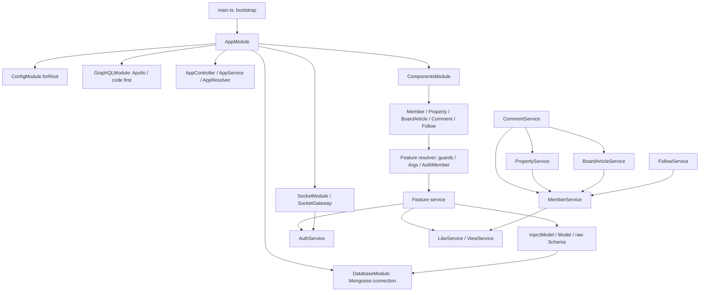

# Nestar architecture review

## Current audit before the newly authorized refactor

On 2026-10-08, the existing working tree was snapshotted and the source was read again before any application edit in this turn. Earlier refactor records below describe changes already present at that baseline; they are not new work attributed to this turn.

The current full-read evidence and contracts are recorded in [AUDIT_INFRASTRUCTURE.md](AUDIT_INFRASTRUCTURE.md), [AUDIT_AUTH_MEMBER.md](AUDIT_AUTH_MEMBER.md), [AUDIT_SOCIAL.md](AUDIT_SOCIAL.md), and [AUDIT_DOMAINS.md](AUDIT_DOMAINS.md). Together they cover both applications' authored source, feature DTOs/enums/schemas, imported shared files, target tests, and workspace/configuration files. Nestar remained read only. The inventories distinguish full reads from partial cross-consumer followups; complete domain coverage comes from the assigned full-read audit, not those snippets.

One verified difference is DTO inheritance. Nestar `apps/nestar-api/src/libs/dto/property/property.input.ts: PropertiesInquiry, AgentPropertiesInquiry, AllPropertiesInquiry, OrdinaryInquiry` and `libs/dto/board-article/board-article.input.ts: BoardArticlesInquiry, AllBoardArticlesInquiry` declare independent input classes. No authored Nestar API DTO uses `extends`, abstract pagination inputs or mapped types. SkiResort's Resort/Equipment/Event/Faq search and inquiry classes inherit decorators/fields. An explicit-declaration refactor was attempted, then restored to the exact starting working-tree contents: inherited GraphQL fields are processed parent-first, whereas class-validator metadata is processed child-first. A single direct declaration order changes one of the two existing error-message arrays. Retaining this difference preserves the target's public errors without adding a framework helper or changing the API. The conflict and verification are recorded in the parity plan.

Nestar's async resolver style is not forced onto synchronous SkiResort validation boundaries. Existing resolver tests require invalid IDs to throw synchronously. Both the current DTO plan and retained differences are documented before edits in [SKIRESORT_PARITY_PLAN.md](SKIRESORT_PARITY_PLAN.md).

Reviewed on 2026-10-08. Reference root: `C:/Users/Aziz/Desktop/nestar` (read only). Paths below are relative to that root unless explicitly marked SkiResort. Current source, rather than dated context notes, is the evidence.

## Scope and evidence

Read the root instructions, package manifest, Nest workspace, root/build/app TypeScript configurations, ESLint and Prettier configurations, every file in `apps/nestar-api/src`, every file in `apps/nestar-batch/src`, and both applications' e2e tests/configurations. There are no nested AGENTS files or repository-level shared `libs` directories in the discovered tree. The complete file list and source line counts are in [SOURCE_INVENTORY.md](SOURCE_INVENTORY.md). No environment values, credentials, deployment settings, Git metadata or reference files were copied into the target.

Both workspaces use a single root npm package, Nest CLI monorepo projects, `nodenext`, decorator metadata, `strictNullChecks`, and an empty `paths` mapping. Imports are relative within the API; batch imports the API's schema/DTO/enum files directly. There is no independent backend package manifest. Nestar's formatter specifies single quotes and trailing commas, although much of its source predates consistent formatting. Its lint and format scripts mutate files; verification must invoke the underlying tools without fixing.

## Bootstrap and dependency flow

`main.ts: bootstrap` creates AppModule, registers ValidationPipe and LoggingInterceptor, enables credentialed CORS, installs upload middleware (15,000,000 bytes / ten files), exposes `/uploads`, installs WsAdapter and listens on `PORT_API` with fallback 3000. It does not install a global guard or exception filter. `app.module.ts: AppModule` registers Apollo with playground, uploads and in-memory auto-schema; its formatter preserves error code and selects nested response messages. `app.controller.ts: getHello` delegates GET `/` to AppService; `app.resolver.ts: sayHello` exposes a separate GraphQL greeting. These are greeting/status responses, not database health probes.

`database/database.module.ts: DatabaseModule` uses `forRootAsync/useFactory` to choose a Mongo URI by NODE_ENV and exports MongooseModule. Feature modules independently register their model names through `forFeature`. DatabaseModule's injected Connection reports its ready state. No database operation was executed during this audit.

## Verified conventions

| Area | Exact reference | Observed pattern |
| --- | --- | --- |
| Feature layout | `components/property/property.{module,resolver,service}.ts` | Three feature-local classes; input/update/output under `libs/dto/property`; enums under `libs/enums`; schema under `schemas/Property.model.ts` |
| Model registration | `components/member/member.module.ts: MemberModule` | Separate Member and Follow registrations; imports Auth/View/Like; providers resolver/service; exports MemberService |
| Persistence | `schemas/Property.model.ts`, `schemas/Member.model.ts` | Raw `new Schema`, explicit collection and timestamps; ObjectId references and indexes; default schema export |
| Injection | `components/comment/comment.service.ts: constructor` | `@InjectModel('Comment') private readonly ...: Model<Comment>` plus constructor-injected target services |
| Public API | `components/board-article/board-article.resolver.ts: createBoardArticle/updateBoardArticle` | `@Resolver()`, method `@Query/@Mutation`, `@Args`, `@AuthMember`, `public async`, explicit Promise result, `return await` delegation; identifier conversion before service calls |
| Security wiring | `components/auth/guards/*.ts`, `decorators/*.ts` | AuthGuard requires token; WithoutGuard permits guests; Roles sets metadata; RolesGuard verifies token and role; AuthMember reads the context populated by guards |
| Service flow | `components/board-article/board-article.service.ts: createBoardArticle/updateBoardArticle` | Assign authenticated owner, create, update counters through another service; conditional owner/ACTIVE update; exceptions on missing result |
| Lists | `components/property/property.service.ts: getProperties/shapeMatchQuery` | Local match and sort, private filter shaping, aggregate match/sort/facet; skip/limit/joins inside list and count in metaCounter; return first facet |
| Shared actions | `components/comment/comment.module.ts` and `CommentService.createComment` | Import target modules, inject exported target services, switch on group and call stats methods; no reverse Comment import |
| Favorites/history | `components/like/like.service.ts: getFavoriteProperties`, `components/view/view.service.ts: getVisitedProperties` | Shared services own association-model joins, target extraction and count; PropertyService delegates |
| DTOs | `libs/dto/board-article/board-article.{input,update,ts}` | Explicit classes; validation above Field; String IDs, Int counters, Date timestamps, nullable optional fields; server-only owner lacks Field |
| Enums | `libs/enums/member.enum.ts`, `property.enum.ts` | String persisted values, adjacent registerEnumType with matching GraphQL names; Direction maps ASC/DESC to 1/-1 |
| Batch | `apps/nestar-batch/src/batch.{module,controller,service}.ts` | ScheduleModule, controller Cron handlers, injected models, service updateMany/find/map/Promise.all; direct imports of API types and schemas |

Constructor dependencies are not uniformly readonly in Nestar; use the readonly form verified in CommentService for unchanged dependencies. Method ordering and formatting also vary: do not invent a rigid convention the reference does not have. The actual reference does **not** use @Schema/@Prop/SchemaFactory, ResolveField/ResolveProperty, ArgsType, ID scalars, forwardRef, generic repositories, CQRS, or mapped DTO types in these source trees. Do not add them to achieve superficial parity.

## End-to-end contracts

MemberResolver delegates signup/login, profile access/update, directory, likes and admin operations to MemberService. Signup hashes before creation and attaches a token; login selects the hidden password and checks state/password. Member detail records a first view, obtains likes and checks Follow directly. PropertyResolver uses AGENT writes, public optional-auth reads, authenticated likes/history and ADMIN operations. PropertyService owns filters, property state and counters, calling MemberService and Like/View. BoardArticleResolver uses authenticated creation/owner updates/likes, optional-auth reads and ADMIN maintenance. BoardArticleService manages article state and member article counts. CommentResolver protects create/update and admin delete, and permits optional-auth lists; CommentService updates target counters on creation. FollowResolver protects subscribe/unsubscribe and permits optional-auth list queries; FollowService validates the target and adjusts both member counts. Like and View have no public resolver.

The detailed callable/type/schema/module inventory is in [CONTRACT_INVENTORY.md](CONTRACT_INVENTORY.md), including class/member names and line references. Notice and Notification are schema/enum-only; no corresponding active feature module exists. Socket uses optional token verification, guest broadcast, join/leave info, and a five-message in-memory history. Batch has rollback, property ranking and agent ranking jobs; these are reference business rules, not SkiResort requirements.

## Reference limitations that must not be copied

`MemberService.updateMember` passes password changes without hashing; signup/self updates accept privileged fields in the reference. Guards use token claims rather than refreshing account state. AuthGuard logs headers, member resolvers log credential inputs, AuthService logs payloads, and the interceptor logs request/response fragments. The reference Like schema uses ViewGroup, and several aggregate member joins do not exclude credentials. Cross-record counters are separate writes, with incomplete deletion cleanup. Property SOLD/DELETE timestamps are assigned to local variables without inserting them into the update payload. These observations describe source behavior; this refactor does not authorize implementing those behaviors in SkiResort.

SkiResort differences, retained safeguards and the dependency-ordered implementation map are recorded in [SKIRESORT_PARITY_PLAN.md](SKIRESORT_PARITY_PLAN.md).

## Second-pass service evidence

Reopened the complete PropertyService, BoardArticleService, CommentService, MemberService, FollowService, LikeService and ViewService for the expanded component pass. `PropertyService.getProperties` starts with local match/sort and calls `shapeMatchQuery(match, input): void`; the helper edits that match and leaves aggregation in the service. Resort/Equipment now apply this verified convention without changing their stronger filters/validation. `BoardArticleService.createBoardArticle` awaits a named persistence result before returning it; Event/Faq now use the same explicit result sequence while preserving their plain-object return. `getBoardArticle` declares a local search before querying; Event/Faq detail helpers do likewise. Nestar shared history services construct a typed Properties result from aggregation output; SkiResort shared histories now use typed Resorts/Equipments results.

Nestar's .prettierrc and SkiResort's are identical (singleQuote and trailingComma all). The expanded pass applies that actual configured source style to backend modules, resolvers, services, DTOs, enums, raw schemas, shared/root/socket and batch files. Inherited CRUD code already using the direct Nestar patterns is retained. Private helper placement varies in the reference (Property's shapeMatchQuery sits next to public list/history; Follow's registerSubscription follows subscribe); no universal public-first architecture was invented. Target-only transactions, current-role checks, exact undo and query projections remain necessary differences.
