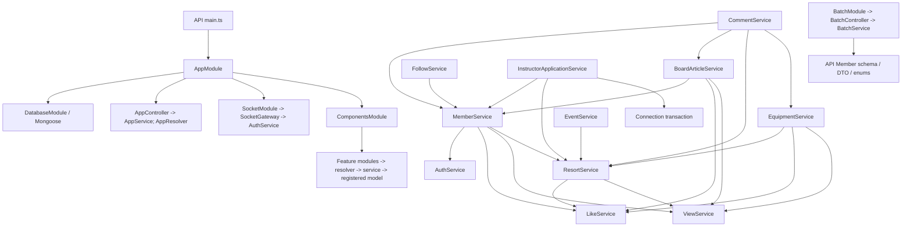

# SkiResort parity plan

## Final disposition of the newly authorized pass

The complete current source audit is finished. The existing working tree already contains the earlier Nestar-style refactor documented below. Matching implementations and necessary SkiResort business/security differences were retained. The four proposed DTO inheritance changes were stopped and restored to the exact current-turn snapshot; no additional application source changes remain from this pass.

The attempted explicit classes passed type-checks, relevant tests, sorted schema equality and effective validator/value comparisons. Independent ordered-response probes then found a compatibility conflict. class-validator gathers child metadata before parent metadata, while GraphQL exposes inherited fields parent-first. Declaring parent fields first changes ValidationPipe error order; declaring child fields first preserves that order but changes GraphQL variable-coercion errors. The final matrix covered 18 classes / 1,104 transformation and default ValidationPipe cases, plus 17 exposed input types / 572 GraphQL coercion cases. The attempted child-first form changed 16 GraphQL error arrays. These are observable responses, so the requirement to preserve SkiResort errors takes precedence over identical Nestar DTO declarations.

Final decision: retain the existing search/inquiry inheritance in Resort, Equipment, Event and Faq as a documented compatibility exception. All original names, validators, nested transformation, defaults, schema fields, module wiring and synchronous/async boundaries remain. No new helper, package, endpoint or business rule was added. The proposal table below is retained as the pre-edit migration map, not a claim that those source changes survived verification.

### Final current-pass verification

Audit started 2026-10-08; verification completed 2026-10-09. All 152 application TypeScript/JSON files (including app configs) are byte-identical to the starting working-tree snapshot. The tests/type-checks/format/lint baseline therefore describes the retained source, not an untested post-edit version. All 84 Nestar inventory hashes are unchanged. The eight current documentation files are the retained changes from this pass.

| Command/check | Current result |
| --- | --- |
| `node node_modules/typescript/bin/tsc -p apps/skiresort-api/tsconfig.app.json --noEmit --incremental false` | Passed |
| Same command with `apps/skiresort-batch/tsconfig.app.json` | Passed |
| Existing Jest via `node node_modules/jest/bin/jest.js --runInBand --silent`, test Mongo URI empty | 31 suites / 548 tests passed; one suite / seven database tests skipped |
| Final existing builds via `node node_modules/@nestjs/cli/bin/nest.js build` and `build skiresort-batch` | Both webpack builds passed; neither app started |
| Offline GraphQLSchemaFactory, all ten API resolver classes | Schema valid; complete sorted SDL exactly equals this pass's pre-edit baseline |
| Effective DTO metadata/values/validation baseline | Exact equality across 18 classes / 1,000 cases |
| Unsorted class-validator errors, values and actual default ValidationPipe responses | Exact equality across 18 classes / 1,104 cases, including 285 accepted inputs |
| Raw GraphQL coerceInputValue/getVariableValues responses with identical input ordering | Exact equality across 17 exposed affected input types / 572 cases; zero field-order or error-array changes after restoration |
| Isolated AppController/AppService greeting | GET `/`: HTTP 200, exact SkiResort greeting; no AppModule/env/database loaded; AppResolver.sayHello also unchanged |
| Prettier --check, all 114 non-test app source files | Passed |
| Non-fixing ESLint, same 114 files | Not passed: 154 existing errors / 19 warnings; source was restored exactly, so no new source diagnostics remain |
| Repository-configured `git diff --check`; new audit Markdown whitespace check | Passed; Git emitted line-ending notices |

Commands used the existing Node executable at `C:/Users/Aziz/AppData/Local/Temp/skiresort-node20-repair/node-v20.19.0-win-x64/node.exe` because Node was absent from PATH. Temporary parity probes/snapshots live outside the repository; they are verification artifacts, not new application utilities. No dependency/configuration/remote/infrastructure change was made. Database integration, real AppModule bootstrap and configured e2e were not run. The inherited DTO compatibility difference and previously documented auth/privacy risks remain; exact textual parity is not claimed.

## Current authorized pass: recorded before application edits

The starting working tree already contains earlier refactoring and documentation. Those edits were preserved and snapshotted before this pass; reports further below are historical baseline records. The current per-file reviews, contracts and teaching traces are in [AUDIT_INFRASTRUCTURE.md](AUDIT_INFRASTRUCTURE.md), [AUDIT_AUTH_MEMBER.md](AUDIT_AUTH_MEMBER.md), [AUDIT_SOCIAL.md](AUDIT_SOCIAL.md), and [AUDIT_DOMAINS.md](AUDIT_DOMAINS.md). All assigned source/tests were fully read before the following plan was recorded. No inaccessible reference or unread application component remains in the discovered audit scope.

| SkiResort file | Verified Nestar reference | Remaining difference | Proposed adjustment (stopped after ordered-error verification) | Contracts preserved |
| --- | --- | --- | --- | --- |
| `apps/skiresort-api/src/libs/dto/resort/resort.input.ts` | `apps/nestar-api/src/libs/dto/property/property.input.ts: PropertiesInquiry / AllPropertiesInquiry / OrdinaryInquiry` | Admin search and catalog inquiries inherit fields | Explicit fields in AllResortSearch, ResortsInquiry and AllResortsInquiry; retain exported ResortHistoryInquiry | Exact names/scalars/nullability, page/limit bounds, sort/enum checks, nested range validation and default search instances |
| `apps/skiresort-api/src/libs/dto/equipment/equipment.input.ts` | Same Property input classes and independent admin search | Admin search and catalog inquiries inherit fields | Explicit fields in AllEquipmentSearch, EquipmentsInquiry and AllEquipmentsInquiry; retain exported EquipmentHistoryInquiry | Full catalog/rental/purchase filters, trimming, nested transformation, integer bounds and default search instances |
| `apps/skiresort-api/src/libs/dto/event/event.input.ts` | Property inquiries; `libs/dto/board-article/board-article.input.ts: BoardArticlesInquiry / AllBoardArticlesInquiry` | Admin search inherits public search; private abstract EventPagination supplies fields | Explicit AllEventSearch / EventsInquiry / AllEventsInquiry; remove only the replaced unexported EventPagination | Existing optional search/status behavior, page/limit/sort/direction constraints; EventInput/create/update contracts unchanged |
| `apps/skiresort-api/src/libs/dto/faq/faq.input.ts` | Same independent Nestar article/property inputs | Admin search inherits public search; private abstract FaqPagination supplies fields | Explicit AllFaqSearch / FaqsInquiry / AllFaqsInquiry; remove only the replaced unexported FaqPagination | Existing text/status filters and omission/null validation; create/update defaults unchanged |
| Root/database/shared/auth/member/social/schema/socket/batch and remaining domain files | Exact corresponding files or nearest analogues in the four current audit reports | Already matching or required SkiResort behavior/security differences | Reviewed: no source change needed | All operations, injection/wiring, persisted fields/collections/indexes, permission checks, error boundaries and business actions |

The recorded implementation order was Resort DTO batch, then Equipment DTO batch, then Event DTO batch, then Faq DTO batch. Each received snapshot-diff review, API no-emit checking, relevant existing tests and offline schema/DTO comparison. Ordered GraphQL response comparison subsequently rejected the proposal, so all four files were restored. No module/resolver/service/schema rewrite is justified by the completed comparison. Public history classes and private abstract pagination inputs remain in use. Do not convert synchronous resolvers/services to async or weaken transaction/compensation/projection behavior.

Current pre-edit verification: API and batch no-emit checks passed; full existing Jest baseline passed 31 suites / 548 tests, with one suite / seven database tests skipped. All 114 non-test application source files passed Prettier check. Full non-fixing ESLint has 154 existing errors / 19 warnings; it did not pass. An offline GraphQLSchemaFactory baseline was generated from all ten API resolver classes without AppModule, environment loading or a database. Its full sorted SDL and 1,000 transformation/validation cases for 18 affected search/inquiry classes were captured for exact comparison after each batch.

The local installed Node executable needs automatically reviewed elevated execution because normal sandbox module resolution raises EPERM on the user directory. No packages were installed. Real database integration, environment-selected application bootstrap and configured e2e remain not run; batch must not be started because its schedules can write ranks. Existing credential logging, plaintext password updates, token-role snapshots, legacy counter behavior and schema-only PROPERTY remnants are recorded differences/risks, not newly authorized fixes.

Audit baseline: current working tree on 2026-10-08, including pre-existing user edits. No application source was edited before this map. Target paths below are relative to SkiResort; Nestar paths are relative to `C:/Users/Aziz/Desktop/nestar`.

## Coverage and baseline

Read root AGENTS.md completely; both manifests/workspaces/TypeScript configurations, formatting/lint settings, all API and batch source, all unit/schema/GraphQL tests, and both e2e suites/configurations. [SOURCE_INVENTORY.md](SOURCE_INVENTORY.md) lists every inspected source file. [CONTRACT_INVENTORY.md](CONTRACT_INVENTORY.md) records operations, DTO fields/decorators, schema fields, module metadata and method signatures with line references. The schema snapshot is generated independently of AppModule, Mongo and `.env`, and will be compared after refactoring.

Both APIs already use Nestar's folder layout, raw schemas, feature modules, constructor injection and code-first GraphQL. Root bootstrap/database/socket and most inherited features already match. No bookings, payment, queue, notification API or notice API exists in the audited source; none will be added. Equipment, Event, Faq and instructor application have no direct Nestar business analogue.

Initial API and batch no-emit type-checks passed using the existing Node 20 executable. Node is absent from PATH and sandboxed execution hits EPERM resolving `C:/Users/Aziz`; locally approved checks use its absolute path. Existing tests use `SKIRESORT_TEST_MONGO_URI` cleared to avoid any database activity. The existing batch rank test expects 22 from 3 articles, 4 likes and 5 views; memberProperties is deliberately not part of SkiResort ranking.

## Target dependency flow



The module graph has no forwardRef and needs none. Resort does not import MemberModule: its projected owner lookup avoids a Member↔Resort cycle. Equipment/Event/Faq/application register Member models locally for current-role checks. MemberService promotion accepts a caller-owned transaction; application does not inject its own service back into Member.

## Component comparison and intended adjustments

Every related DTO/schema/module file is enumerated in the linked inventories; the rows below describe the coherent file groups and exact pattern anchors.

| SkiResort file/group | Nestar reference file/pattern | Difference | Intended adjustment | Behavior that must stay unchanged |
| --- | --- | --- | --- | --- |
| API `main.ts`, `app.*`, `database/database.module.ts` | Same relative Nestar API files | Greeting text is SkiResort; otherwise wiring already matches | Retain; no bootstrap/config rewrite | ValidationPipe, middleware order, errors, upload limits, CORS, ports, greetings |
| `libs/types/common.ts`, `libs/enums/*.ts`, `schemas/*.model.ts` | Same groups; Property schema for nearest Resort structure | Domain-specific fields/defaults/indexes and stricter validators; unused Notification retains PROPERTY/propertyId | Retain names/data/validation; do not migrate schemas | All persisted fields, enum values, collections, unique indexes, hooks and versionKey |
| `libs/config.ts`, `libs/image-upload.ts` | Nestar `libs/config.ts` | Group-aware likes, ID validation, safe history projections and safe filesystem uploads | Retain safeguards/helpers | Group discriminator, error strings, relative paths, exclusive write, cleanup, event target reservation |
| `components/auth/**` | Nestar same files | Already follows reference, including known defects | Retain in this style refactor; record risks | JWT expiry/claims, bcrypt flows, guard/context behavior and errors |
| `components/like/*`, `components/view/*` | Nestar same module/service files | Race handling, exact undo snapshots, group checks, Resort/Equipment history filters | Keep service-only/exported composition; retain implementation | Duplicate/no-change handling, idempotent undo, credentials excluded, missing owners kept, count before pagination |
| `components/member/*`, `libs/dto/member/*` | Nestar MemberModule/Resolver/Service and member DTOs | USER-only signup, role protection, transactional promotion, instructor profile and Resort dependency | Already structural parity; preserve current edits and workflow | Original query spellings, role restrictions, allowed fields, instructor directory, token refresh, phone/address fields |
| `components/board-article/*`, article DTO/schema/enum | Nestar same files | SkiResort categories; group-aware like join | Retain; no cosmetic rewrite of matching implementation | Ownership/ACTIVE filters, counters, errors, category values, admin removal rules |
| `components/follow/*`, follow DTO/schema | Nestar same files | Duplicate subscription is idempotent | Retain verified local helper and unique pair index | Only winning insert changes counters; self-subscription error; list join semantics |
| `components/resort/resort.{module,resolver,service}.ts`, resort DTO/schema | Nestar property module/resolver/service and explicit property DTOs | ADMIN catalog, SOLD_OUT visible, no property ranking, projected owners, conditional counter safety; resolver implicit public | Make resolver visibility explicit; retain synchronous validation boundaries and private business helpers | Identity collation/index, statuses, pagination/filter/sort, mutation names, errors, history input type, compensation |
| `components/equipment/*`, equipment DTO/schema | Nestar PropertyModule/Resolver/Service; explicit field declarations | Catalog variants/rental packages/purchase capability, current admin checks; compact DTO declarations | Explicit resolver visibility; expand compact DTO decorators/fields into Nestar's readable one-per-line layout | Size normalization, package order, quantities, price invariants, concurrency predicates, sync validation/history errors |
| `components/event/event.{module,resolver,service}.ts`, `libs/dto/event/*` | Nestar BoardArticle module/resolver/service and `board-article.update.ts` | Missing public/return annotations; update combined with input and uses PartialType | Explicit public async/Promise thin resolver delegation and public service methods; move update to `.update.ts`, declare fields explicitly | DRAFT default only on create; omission vs null; published-only public reads, admin recheck, schedules, image checks/cleanup, errors |
| `components/faq/faq.{module,resolver,service}.ts`, `libs/dto/faq/*` | Nestar BoardArticle resolver/service and explicit update DTO | Same structural differences as Event; no direct FAQ reference API | Same explicit update file and typed public delegation | Required question/answer, draft/published, omission, nullable input semantics, current admin checks, hard delete |
| `components/instructor-application/*`, application DTO/schema | Nestar CommentService composition and MemberModule exports | Transaction workflow has no reference analogue; resolver implicit public | Explicit resolver visibility; retain sync ObjectId validation and transaction body unchanged | PENDING uniqueness, approval/promotion atomicity, review history, current-role checks, nullable own result |
| `components/components.module.ts` | Nestar same file | Additional SkiResort modules, imports inserted ahead of Nest imports | Order imports with framework first then domain modules as reference; keep registrations identical | Exactly the existing imported modules and dependency direction |
| `socket/*` | Nestar same files | Already matches | Retain | Guest auth, frame/event names, five-message history, broadcasts |
| `apps/skiresort-batch/src/**` | `apps/nestar-batch/src/**` | Instructor-only ranking; no property rank task | Retain; compile shared contracts | Cron names/times, member-only model and current formula; do not copy AGENT/property jobs |

## Business and contract constraints

Resorts are ADMIN-created; ACTIVE/SOLD_OUT are public, DELETE hidden. Identity is global and case-insensitive across location/title/address/level, including deleted records. Updates allow content/status without timestamp lifecycle or an ACTIVE-only restriction; removal is hard delete. Equipment is visible only AVAILABLE; sizes and rental packages are normalized, purchase price must agree with purchasable, and dependent updates use compare predicates. Favorites/visited exclude hidden targets before count/pagination. Counter decrements cannot underflow and failed writes trigger exact compensation.

Events/Faqs expose only PUBLISHED publicly and all statuses to a currently active ADMIN. Creation uses DRAFT defaults; update omission must not reset publication. Event dates may be past but end must exceed start, images must exist in the event directory, uploads are 1–5 and clean successes if any upload fails. Hard deletion retains image files. Instructor submission is active USER-only, creates a PENDING snapshot and touches Member in a transaction; approval reviews and promotes in the same transaction, rejection retains history without promotion. Profile edits preserve allowed-field filtering and nullable prices/association. Comments retain the existing owner soft-delete behavior (no counter decrement there), while active ADMIN removals compensate Resort/Equipment counters.

## Risks and explicit exceptions

1. Do not replace validators/transforms with Nestar's weaker validators, map Types.ObjectId to a different runtime type, change enum/scalar/nullability/default values, or loosen guards.
2. Async conversion changes synchronous throw behavior. Keep existing synchronous validation/delegation methods in Resort/Equipment/application where needed; explicit `public` is sufficient there. Keep Resort's synchronous filter shaping and Equipment's synchronous history pagination checks.
3. Keep validation decorators' omission/null distinction when removing PartialType. Compare full generated GraphQL schema and existing validation tests before/after, including optional Event location/resort fields.
4. Avoid forcing Nestar's MemberService owner lookup into Resort; that introduces a cycle. Keep current projections and direct role models.
5. Existing auth risks: password updates bypass hashing; generic self-update includes status; JWT guards do not re-read account state; credential/token/header logging; public phone/address and raw association member joins. Comment creation checks catalog visibility, but getComments does not independently recheck it. Preserve contracts and report these separately, rather than silently repairing them here.
6. Notice/Notification still contain reference-like PROPERTY names but have no API module. Changing these would alter persisted contracts outside the requested structural adjustments.
7. Real application startup/e2e would read environment-selected Mongo and batch can write ranks. Do not start those applications. Offline schema generation, mocked tests, safe isolated HTTP greeting and socket tests are the appropriate checks. Transaction integration needs a disposable replica set and will remain explicitly not run.

## Small batches in dependency order

1. Finish this audit/map and generate inventories plus pre-refactor full schema/validation baseline. No application edits until these documents exist.
2. Shared types/enums/schemas/root: no mismatches requiring edits; record retained parity and compile both apps.
3. Event DTO/update organization, resolver/service visibility and explicit result typing. Review diff, check exact schema/validation parity, type-check, Event tests, non-mutating scoped lint/format.
4. FAQ equivalent explicit DTO/update and typed delegation. Same scoped verification.
5. Resort/Equipment/application resolver visibility; Equipment/Event/Faq readable DTO field layout; ComponentsModule import grouping. Keep synchronous boundaries and all service business bodies. Review diff, type-check and relevant existing suites.
6. Confirm inherited features/shared services/socket/batch require no architectural edits. Run existing non-database tests, both builds, full offline schema equality, scoped format/lint, and document limitations.
7. Write [CODE_WALKTHROUGH.md](CODE_WALKTHROUGH.md) with actual files/classes/methods, field/decorator explanations, request paths, all CRUD/non-CRUD rules, consumers, retained differences and verification outcomes. Completion applies only to reviewed, documented, verified components; do not claim unavailable database checks passed.

## Second review: complete component alignment

The user requested a second pass covering services and the rest of each component, beyond the first resolver-focused changes. The earlier completion report describes that narrower implementation. This pass also aligns query construction, persistence/result flow, dependency declarations and consistent source layout. The original contracts and verified Nestar evidence remain authoritative.

| Scope | Nestar evidence | Remaining difference | Planned component changes | Required preservation |
| --- | --- | --- | --- | --- |
| Like/View modules/services/DTOs | Same Nestar files: service-only exports and association aggregation | Equipment imports precede framework imports; output extraction is embedded in return | Group imports with framework/dependencies first; explicit typed result before return | Group-aware undo, duplicate behavior, safe visibility/projections/counting, history order |
| Resort module/service/resolver/DTO/schema | PropertyService.getProperties / shapeMatchQuery / admin methods | Service builds a returned search object instead of shaping the caller match; sort is inline | Use private shapeMatchQuery(match, input), explicit sort object; align method placement and configured formatting | Same predicates, sync errors, facets/empty result, identity/index/visibility, ownership projection, compensation |
| Equipment entire component | PropertyService query structure and CommentService readonly DI | Same search convention difference; interleaved private normalization before public read methods; scattered duplicate imports | Same shapeMatchQuery convention, grouped model injection/imports, service method organization and explicit sort | Current-role recheck, normalized packages/sizes, conditional updates, output, sync history validation, counters/undo |
| Event/FAQ entire components | BoardArticleService create/detail/list flow; explicit update DTO | Chained creation return, anonymous detail filter, inline list sort, mixed public/helper placement | Explicit create result, local search/match/sort, awaited existing async delegation, public operations followed by required helpers | All errors, validation/omission/null, safe event images/upload cleanup, status/date concurrency, admin checks |
| Member/Article/Comment/Follow components and Auth | Direct equivalent Nestar modules/services/resolvers/DTOs; CommentService readonly dependencies | Mixed formatting and scattered imports; newer member/application workflows interrupt consistent declaration layout | Align imports, constructor DI declarations, DTO/schema/module layout using existing formatter; preserve method business bodies | Existing user edits, permissions, credential behavior, counts, follows, promotion sessions and all public names |
| Instructor application | CommentService exported composition; BoardArticle match/sort/result structure | Existing service methods return transaction/query directly; sort variable denotes a key rather than query object | Explicit awaited delegation in already-async methods, sortKey plus sort object; normalize related file layout | Exact transaction callbacks/session ownership, pending index, state/current-role checks, snapshot promotion/history |
| Root/shared/socket/batch | Corresponding read-only reference files and configured .prettierrc | Legacy declaration formatting | Consistent configured formatting and explicit readonly/public declarations where appropriate; no wiring redesign | Same module/model graph, config, middleware, routes, cron schedules and rank formula |

Batches: (1) shared Like/View; (2) Resort/Equipment; (3) Event/FAQ/application; (4) inherited Member/Article/Comment/Follow/Auth and related DTO/modules; (5) root/shared/schema/socket/batch layout and final checks. Each batch gets source-diff review, relevant tests and type-checking. Full SDL equality, source/schema AST preservation, both builds and final navigation/walkthrough update follow. No helper needed for target validation, transactions or compensation will be deleted to make service bodies shorter.

## First-pass completed batches and verification

All discovered source was inspected: the source/test inventory records 84 reference files and 148 target files before edits. Every component is explained in [CODE_WALKTHROUGH.md](CODE_WALKTHROUGH.md); [CODE_NAVIGATION.md](CODE_NAVIGATION.md) identifies final imports, constructor dependencies, methods and fields at their exact source lines. Original contracts/line references remain in CONTRACT_INVENTORY.md; final navigation includes the two newly created update files.

| Batch / inspected scope | Changes / verified reference | Preserved behavior | Outcome |
| --- | --- | --- | --- |
| Root, database, types, enums, schemas | Retained existing Nestar raw-schema/local-registration/root wiring | All database collection/field/index/default values, bootstrap settings | Both app type-checks/builds pass; all 26 target schema/batch source/test hashes unchanged |
| Event module/resolver/service, DTOs, enum/schema/tests | New `libs/dto/event/event.update.ts` explicit DTO like Nestar board-article.update; public async/Promise resolver delegation and public services | Current-admin checks, published visibility, dates/CAS, uploads/files/cleanup, null/omission/defaults | 48 focused tests passed; schema/validation parity passed; scoped lint/format passed |
| FAQ module/resolver/service, DTOs, enum/schema/tests | New `libs/dto/faq/faq.update.ts`; same BoardArticle public typed delegation convention | Current-admin checks, question/answer, visibility, create default vs update omission, hard delete | 38 focused tests passed; schema/validation parity passed; scoped lint/format passed |
| Resort, Equipment, application and consumers | Public resolver declarations as verified in Nestar; readable Equipment/Event/Faq DTO fields; framework-first ComponentsModule imports | Synchronous throws, catalog filters/counters/undo, dependent equipment predicates, approval transaction, identical module list | Final complete existing suite passed; exact full SDL and 132 validation cases unchanged |
| Auth/Member/Article/Comment/Follow/Like/View/socket/batch | Retain equivalent inspected organization, direct constructor DI/exported service composition; no speculative edits | All target-only permissions, association groups, workflows, compensation, history and instructor rank formula | Existing relevant tests pass; both builds pass; walkthrough complete |

Both Event/Faq service method bodies were additionally compared through the TypeScript AST against their original Git versions and are identical. All 84 audited Nestar hashes remain unchanged. Existing member/root/context documentation edits were not overwritten by this refactor. A narrow `.gitignore` exception exposes only the requested backend-refactor documentation directory, retaining the surrounding ignore rules.

Verification used the existing dependency installation. In this session `$nodePath` refers to `C:/Users/Aziz/AppData/Local/Temp/skiresort-node20-repair/node-v20.19.0-win-x64/node.exe`; no Node/package install was performed. Commands below use PowerShell from the target root:

```powershell
& $nodePath node_modules/typescript/bin/tsc -p apps/skiresort-api/tsconfig.app.json --noEmit --incremental false
& $nodePath node_modules/typescript/bin/tsc -p apps/skiresort-batch/tsconfig.app.json --noEmit --incremental false
& $nodePath node_modules/@nestjs/cli/bin/nest.js build
& $nodePath node_modules/@nestjs/cli/bin/nest.js build skiresort-batch
$env:SKIRESORT_TEST_MONGO_URI = ''
& $nodePath node_modules/jest/bin/jest.js --runInBand --silent
```

Builds also temporarily prepended the same Node directory to PATH for CLI subprocesses. Final Jest used `--testPathPattern='(resort|equipment|instructor-application|event|faq)'`; since all paths include `skiresort`, this selected the whole existing suite: 31 suites passed / one skipped, 548 tests passed / seven skipped. The earlier unrestricted baseline had the same result. Scoped `eslint <20 changed TypeScript files> --format json` without fix reported zero errors/warnings; `prettier --check <same files>` passed. The root lint/format scripts use fixing/writing and were deliberately not run over unrelated source. `git diff --check` passed.

Temporary verification scripts (not application features) used GraphQLSchemaBuilderModule/GraphQLSchemaFactory with all resolvers, compared sorted full SDL against GRAPHQL_BASELINE.graphql, and compared transformed DTO values plus validation constraints for 132 pre/post cases. All comparisons passed. Another isolated Nest test module registered only AppController/AppService; GET `/` returned HTTP 200 with the exact greeting. No AppModule/database/env configuration was loaded for either check.

That first-pass report is retained as historical evidence. The expanded component pass is recorded below. Unavailable checks remain the seven disposable-replica-set integration tests, real environment-selected AppModule bootstrap and configured e2e. They were not run or counted as passed. Existing security/privacy defects listed above remain documented scope conflicts; no security behavior was weakened to imitate Nestar.

## Second-pass completion and verification

All five expanded batches are complete. [SECOND_PASS_COMPONENT_REVIEW.md](SECOND_PASS_COMPONENT_REVIEW.md) records the exact disposition and reference for all 114 application source files. Each module/resolver/service/DTO/schema group was checked together; matching Nestar business implementations were retained rather than rewritten into new abstractions. The expanded changes are query shaping, persistence/result flow, existing async delegation, service method organization, imports and the identical configured Prettier style. Model registration lists, constructor argument order, guard/DTO metadata, all persisted schemas/indexes, enum values and root/batch wiring are unchanged.

| Expanded batch | Checks / outcome |
| --- | --- |
| Shared Like/View modules/services/DTOs | API type-check + 12 existing tests passed |
| Resort/Equipment and Comment consumers | API type-check + 150 existing tests passed |
| Event/FAQ/application services | API type-check + 120 existing tests passed |
| Inherited Auth/Member/Article/Comment/Follow layers | API type-check + 90 existing consumer/workflow tests passed; business AST unchanged |
| Root/shared/schema/enum/socket/batch | Both no-emit checks and both Nest/webpack builds passed |
| Final full existing suite (no test-path filter) | 31 suites / 548 tests passed; one suite / seven database tests skipped |
| Offline schema and validation | Entire sorted SDL identical to original baseline; all 132 cases unchanged |
| Isolated HTTP greeting | HTTP 200, exact response; no AppModule/config/database loaded |
| Whole-source formatting | All 114 source files passed; 1,913 baseline formatting diagnostics removed |
| Whole-source lint, no fix | 154 errors / 19 warnings remain vs 2,067 / 19 before; all remaining rule counts match baseline |
| Source preservation | 107 source ASTs unchanged after normalizing trivia and import ordering; only seven planned services differ; all schema/DTO/enum/module metadata unchanged |

Full lint is **not passed**. Remaining inherited typed-rule issues include loose T/any use, unsafe third-party values, unused declarations and original async/enum typing. Removing them wholesale would go beyond the verified behavior-preserving service style changes; they are not claimed repaired. Real database/transaction integration remains not run. Nestar was still only read, and its audited hashes were rechecked. Final code navigation was regenerated after reordering and formatting.

## File-by-file structural comparison

These rows supplement the business comparison above. Equivalent files were compared as full source; same means byte-identical in this audit snapshot. Differences remain subject to the stated contract exceptions.

| SkiResort file | Verified Nestar reference | Difference / adjustment | Preserved contract |
| --- | --- | --- | --- |
| `apps/skiresort-api/src/app.controller.ts` | `apps/nestar-api/src/app.controller.ts` | Already identical; retain | Business branches/query filters/errors/write order |
| `apps/skiresort-api/src/app.module.ts` | `apps/nestar-api/src/app.module.ts` | Already identical; retain | Model names/providers/imports/exports |
| `apps/skiresort-api/src/app.resolver.ts` | `apps/nestar-api/src/app.resolver.ts` | Already identical; retain | Operation/args/guards/results/error boundaries |
| `apps/skiresort-api/src/app.service.ts` | `apps/nestar-api/src/app.service.ts` | Compare domain adaptation; retain existing verified structure | Business branches/query filters/errors/write order |
| `apps/skiresort-api/src/components/auth/auth.module.ts` | `apps/nestar-api/src/components/auth/auth.module.ts` | Already identical; retain | Model names/providers/imports/exports |
| `apps/skiresort-api/src/components/auth/auth.service.ts` | `apps/nestar-api/src/components/auth/auth.service.ts` | Already identical; retain | Business branches/query filters/errors/write order |
| `apps/skiresort-api/src/components/auth/decorators/authMember.decorator.ts` | `apps/nestar-api/src/components/auth/decorators/authMember.decorator.ts` | Already identical; retain | Business branches/query filters/errors/write order |
| `apps/skiresort-api/src/components/auth/decorators/roles.decorator.ts` | `apps/nestar-api/src/components/auth/decorators/roles.decorator.ts` | Already identical; retain | Business branches/query filters/errors/write order |
| `apps/skiresort-api/src/components/auth/guards/auth.guard.ts` | `apps/nestar-api/src/components/auth/guards/auth.guard.ts` | Already identical; retain | Business branches/query filters/errors/write order |
| `apps/skiresort-api/src/components/auth/guards/roles.guard.ts` | `apps/nestar-api/src/components/auth/guards/roles.guard.ts` | Already identical; retain | Business branches/query filters/errors/write order |
| `apps/skiresort-api/src/components/auth/guards/without.guard.ts` | `apps/nestar-api/src/components/auth/guards/without.guard.ts` | Already identical; retain | Business branches/query filters/errors/write order |
| `apps/skiresort-api/src/components/board-article/board-article.module.ts` | `apps/nestar-api/src/components/board-article/board-article.module.ts` | Already identical; retain | Model names/providers/imports/exports |
| `apps/skiresort-api/src/components/board-article/board-article.resolver.ts` | `apps/nestar-api/src/components/board-article/board-article.resolver.ts` | Already identical; retain | Operation/args/guards/results/error boundaries |
| `apps/skiresort-api/src/components/board-article/board-article.service.ts` | `apps/nestar-api/src/components/board-article/board-article.service.ts` | Compare domain adaptation; retain existing verified structure | Business branches/query filters/errors/write order |
| `apps/skiresort-api/src/components/comment/comment.module.ts` | `apps/nestar-api/src/components/comment/comment.module.ts` | Compare domain adaptation; retain existing verified structure | Model names/providers/imports/exports |
| `apps/skiresort-api/src/components/comment/comment.resolver.ts` | `apps/nestar-api/src/components/comment/comment.resolver.ts` | Compare domain adaptation; retain existing verified structure | Operation/args/guards/results/error boundaries |
| `apps/skiresort-api/src/components/comment/comment.service.ts` | `apps/nestar-api/src/components/comment/comment.service.ts` | Compare domain adaptation; retain existing verified structure | Business branches/query filters/errors/write order |
| `apps/skiresort-api/src/components/components.module.ts` | `apps/nestar-api/src/components/components.module.ts` | Framework import first; registrations unchanged | Model names/providers/imports/exports |
| `apps/skiresort-api/src/components/equipment/equipment-size.ts` | `apps/nestar-api/src/components/property/property.service.ts` | No analogue: preserve category size rules | Business branches/query filters/errors/write order |
| `apps/skiresort-api/src/components/equipment/equipment.module.ts` | `apps/nestar-api/src/components/property/property.module.ts` | Compare domain adaptation; retain existing verified structure | Model names/providers/imports/exports |
| `apps/skiresort-api/src/components/equipment/equipment.resolver.ts` | `apps/nestar-api/src/components/property/property.resolver.ts` | Explicit public visibility; preserve sync validation | Operation/args/guards/results/error boundaries |
| `apps/skiresort-api/src/components/equipment/equipment.service.ts` | `apps/nestar-api/src/components/property/property.service.ts` | Compare domain adaptation; retain existing verified structure | Business branches/query filters/errors/write order |
| `apps/skiresort-api/src/components/event/event.module.ts` | `apps/nestar-api/src/components/board-article/board-article.module.ts` | Compare domain adaptation; retain existing verified structure | Model names/providers/imports/exports |
| `apps/skiresort-api/src/components/event/event.resolver.ts` | `apps/nestar-api/src/components/board-article/board-article.resolver.ts` | Explicit public async / Promise result / awaited delegation | Operation/args/guards/results/error boundaries |
| `apps/skiresort-api/src/components/event/event.service.ts` | `apps/nestar-api/src/components/board-article/board-article.service.ts` | Explicit public method visibility / private result types; preserve body | Business branches/query filters/errors/write order |
| `apps/skiresort-api/src/components/faq/faq.module.ts` | `apps/nestar-api/src/components/board-article/board-article.module.ts` | Compare domain adaptation; retain existing verified structure | Model names/providers/imports/exports |
| `apps/skiresort-api/src/components/faq/faq.resolver.ts` | `apps/nestar-api/src/components/board-article/board-article.resolver.ts` | Explicit public async / Promise result / awaited delegation | Operation/args/guards/results/error boundaries |
| `apps/skiresort-api/src/components/faq/faq.service.ts` | `apps/nestar-api/src/components/board-article/board-article.service.ts` | Explicit public method visibility / private result types; preserve body | Business branches/query filters/errors/write order |
| `apps/skiresort-api/src/components/follow/follow.module.ts` | `apps/nestar-api/src/components/follow/follow.module.ts` | Already identical; retain | Model names/providers/imports/exports |
| `apps/skiresort-api/src/components/follow/follow.resolver.ts` | `apps/nestar-api/src/components/follow/follow.resolver.ts` | Already identical; retain | Operation/args/guards/results/error boundaries |
| `apps/skiresort-api/src/components/follow/follow.service.ts` | `apps/nestar-api/src/components/follow/follow.service.ts` | Compare domain adaptation; retain existing verified structure | Business branches/query filters/errors/write order |
| `apps/skiresort-api/src/components/instructor-application/instructor-application.module.ts` | `apps/nestar-api/src/components/comment/comment.module.ts` | Compare domain adaptation; retain existing verified structure | Model names/providers/imports/exports |
| `apps/skiresort-api/src/components/instructor-application/instructor-application.resolver.ts` | `apps/nestar-api/src/components/comment/comment.resolver.ts` | Explicit public visibility; preserve sync validation | Operation/args/guards/results/error boundaries |
| `apps/skiresort-api/src/components/instructor-application/instructor-application.service.ts` | `apps/nestar-api/src/components/comment/comment.service.ts` | Compare domain adaptation; retain existing verified structure | Business branches/query filters/errors/write order |
| `apps/skiresort-api/src/components/like/like.module.ts` | `apps/nestar-api/src/components/like/like.module.ts` | Already identical; retain | Model names/providers/imports/exports |
| `apps/skiresort-api/src/components/like/like.service.ts` | `apps/nestar-api/src/components/like/like.service.ts` | Compare domain adaptation; retain existing verified structure | Business branches/query filters/errors/write order |
| `apps/skiresort-api/src/components/member/member.module.ts` | `apps/nestar-api/src/components/member/member.module.ts` | Compare domain adaptation; retain existing verified structure | Model names/providers/imports/exports |
| `apps/skiresort-api/src/components/member/member.resolver.ts` | `apps/nestar-api/src/components/member/member.resolver.ts` | Compare domain adaptation; retain existing verified structure | Operation/args/guards/results/error boundaries |
| `apps/skiresort-api/src/components/member/member.service.ts` | `apps/nestar-api/src/components/member/member.service.ts` | Compare domain adaptation; retain existing verified structure | Business branches/query filters/errors/write order |
| `apps/skiresort-api/src/components/resort/resort.module.ts` | `apps/nestar-api/src/components/property/property.module.ts` | Compare domain adaptation; retain existing verified structure | Model names/providers/imports/exports |
| `apps/skiresort-api/src/components/resort/resort.resolver.ts` | `apps/nestar-api/src/components/property/property.resolver.ts` | Explicit public visibility; preserve sync validation | Operation/args/guards/results/error boundaries |
| `apps/skiresort-api/src/components/resort/resort.service.ts` | `apps/nestar-api/src/components/property/property.service.ts` | Compare domain adaptation; retain existing verified structure | Business branches/query filters/errors/write order |
| `apps/skiresort-api/src/components/view/view.module.ts` | `apps/nestar-api/src/components/view/view.module.ts` | Already identical; retain | Model names/providers/imports/exports |
| `apps/skiresort-api/src/components/view/view.service.ts` | `apps/nestar-api/src/components/view/view.service.ts` | Compare domain adaptation; retain existing verified structure | Business branches/query filters/errors/write order |
| `apps/skiresort-api/src/database/database.module.ts` | `apps/nestar-api/src/database/database.module.ts` | Already identical; retain | Model names/providers/imports/exports |
| `apps/skiresort-api/src/libs/config.ts` | `apps/nestar-api/src/libs/config.ts` | Compare domain adaptation; retain existing verified structure | Business branches/query filters/errors/write order |
| `apps/skiresort-api/src/libs/dto/board-article/board-article.input.ts` | `apps/nestar-api/src/libs/dto/board-article/board-article.input.ts` | Already identical; retain | Fields/scalars/defaults/nullability/validators |
| `apps/skiresort-api/src/libs/dto/board-article/board-article.ts` | `apps/nestar-api/src/libs/dto/board-article/board-article.ts` | Already identical; retain | Fields/scalars/defaults/nullability/validators |
| `apps/skiresort-api/src/libs/dto/board-article/board-article.update.ts` | `apps/nestar-api/src/libs/dto/board-article/board-article.update.ts` | Already identical; retain | Fields/scalars/defaults/nullability/validators |
| `apps/skiresort-api/src/libs/dto/comment/comment.input.ts` | `apps/nestar-api/src/libs/dto/comment/comment.input.ts` | Compare domain adaptation; retain existing verified structure | Fields/scalars/defaults/nullability/validators |
| `apps/skiresort-api/src/libs/dto/comment/comment.ts` | `apps/nestar-api/src/libs/dto/comment/comment.ts` | Already identical; retain | Fields/scalars/defaults/nullability/validators |
| `apps/skiresort-api/src/libs/dto/comment/comment.update.ts` | `apps/nestar-api/src/libs/dto/comment/comment.update.ts` | Already identical; retain | Fields/scalars/defaults/nullability/validators |
| `apps/skiresort-api/src/libs/dto/equipment/equipment.input.ts` | `apps/nestar-api/src/libs/dto/property/property.input.ts` | Expand decorators and fields to separate lines | Fields/scalars/defaults/nullability/validators |
| `apps/skiresort-api/src/libs/dto/equipment/equipment.ts` | `apps/nestar-api/src/libs/dto/property/property.ts` | Expand decorators and fields to separate lines | Fields/scalars/defaults/nullability/validators |
| `apps/skiresort-api/src/libs/dto/equipment/equipment.update.ts` | `apps/nestar-api/src/libs/dto/property/property.update.ts` | Expand decorators and fields to separate lines | Fields/scalars/defaults/nullability/validators |
| `apps/skiresort-api/src/libs/dto/event/event.input.ts` | `apps/nestar-api/src/libs/dto/board-article/board-article.input.ts` | Replace mapped update with explicit separate update DTO; retain validators | Fields/scalars/defaults/nullability/validators |
| `apps/skiresort-api/src/libs/dto/event/event.ts` | `apps/nestar-api/src/libs/dto/board-article/board-article.ts` | Compare domain adaptation; retain existing verified structure | Fields/scalars/defaults/nullability/validators |
| `apps/skiresort-api/src/libs/dto/faq/faq.input.ts` | `apps/nestar-api/src/libs/dto/board-article/board-article.input.ts` | Replace mapped update with explicit separate update DTO; retain validators | Fields/scalars/defaults/nullability/validators |
| `apps/skiresort-api/src/libs/dto/faq/faq.ts` | `apps/nestar-api/src/libs/dto/board-article/board-article.ts` | Compare domain adaptation; retain existing verified structure | Fields/scalars/defaults/nullability/validators |
| `apps/skiresort-api/src/libs/dto/follow/follow.input.ts` | `apps/nestar-api/src/libs/dto/follow/follow.input.ts` | Already identical; retain | Fields/scalars/defaults/nullability/validators |
| `apps/skiresort-api/src/libs/dto/follow/follow.ts` | `apps/nestar-api/src/libs/dto/follow/follow.ts` | Already identical; retain | Fields/scalars/defaults/nullability/validators |
| `apps/skiresort-api/src/libs/dto/instructor-application/instructor-application.input.ts` | `apps/nestar-api/src/libs/dto/comment/comment.input.ts` | Compare domain adaptation; retain existing verified structure | Fields/scalars/defaults/nullability/validators |
| `apps/skiresort-api/src/libs/dto/instructor-application/instructor-application.ts` | `apps/nestar-api/src/libs/dto/comment/comment.ts` | Compare domain adaptation; retain existing verified structure | Fields/scalars/defaults/nullability/validators |
| `apps/skiresort-api/src/libs/dto/like/like.input.ts` | `apps/nestar-api/src/libs/dto/like/like.input.ts` | Already identical; retain | Fields/scalars/defaults/nullability/validators |
| `apps/skiresort-api/src/libs/dto/like/like.ts` | `apps/nestar-api/src/libs/dto/like/like.ts` | Already identical; retain | Fields/scalars/defaults/nullability/validators |
| `apps/skiresort-api/src/libs/dto/member/instructor-profile.update.ts` | `apps/nestar-api/src/libs/dto/member/member.update.ts` | No instructor analogue: preserve explicit profile validation | Fields/scalars/defaults/nullability/validators |
| `apps/skiresort-api/src/libs/dto/member/member.input.ts` | `apps/nestar-api/src/libs/dto/member/member.input.ts` | Compare domain adaptation; retain existing verified structure | Fields/scalars/defaults/nullability/validators |
| `apps/skiresort-api/src/libs/dto/member/member.ts` | `apps/nestar-api/src/libs/dto/member/member.ts` | Compare domain adaptation; retain existing verified structure | Fields/scalars/defaults/nullability/validators |
| `apps/skiresort-api/src/libs/dto/member/member.update.ts` | `apps/nestar-api/src/libs/dto/member/member.update.ts` | Already identical; retain | Fields/scalars/defaults/nullability/validators |
| `apps/skiresort-api/src/libs/dto/resort/resort.input.ts` | `apps/nestar-api/src/libs/dto/property/property.input.ts` | Compare domain adaptation; retain existing verified structure | Fields/scalars/defaults/nullability/validators |
| `apps/skiresort-api/src/libs/dto/resort/resort.ts` | `apps/nestar-api/src/libs/dto/property/property.ts` | Compare domain adaptation; retain existing verified structure | Fields/scalars/defaults/nullability/validators |
| `apps/skiresort-api/src/libs/dto/resort/resort.update.ts` | `apps/nestar-api/src/libs/dto/property/property.update.ts` | Compare domain adaptation; retain existing verified structure | Fields/scalars/defaults/nullability/validators |
| `apps/skiresort-api/src/libs/dto/view/view.input.ts` | `apps/nestar-api/src/libs/dto/view/view.input.ts` | Already identical; retain | Fields/scalars/defaults/nullability/validators |
| `apps/skiresort-api/src/libs/dto/view/view.ts` | `apps/nestar-api/src/libs/dto/view/view.ts` | Already identical; retain | Fields/scalars/defaults/nullability/validators |
| `apps/skiresort-api/src/libs/enums/board-article.enum.ts` | `apps/nestar-api/src/libs/enums/board-article.enum.ts` | Compare domain adaptation; retain existing verified structure | Business branches/query filters/errors/write order |
| `apps/skiresort-api/src/libs/enums/comment.enum.ts` | `apps/nestar-api/src/libs/enums/comment.enum.ts` | Compare domain adaptation; retain existing verified structure | Business branches/query filters/errors/write order |
| `apps/skiresort-api/src/libs/enums/common.enum.ts` | `apps/nestar-api/src/libs/enums/common.enum.ts` | Already identical; retain | Business branches/query filters/errors/write order |
| `apps/skiresort-api/src/libs/enums/equipment.enum.ts` | `apps/nestar-api/src/libs/enums/property.enum.ts` | Compare domain adaptation; retain existing verified structure | Business branches/query filters/errors/write order |
| `apps/skiresort-api/src/libs/enums/event.enum.ts` | `apps/nestar-api/src/libs/enums/board-article.enum.ts` | Compare domain adaptation; retain existing verified structure | Business branches/query filters/errors/write order |
| `apps/skiresort-api/src/libs/enums/faq.enum.ts` | `apps/nestar-api/src/libs/enums/board-article.enum.ts` | Compare domain adaptation; retain existing verified structure | Business branches/query filters/errors/write order |
| `apps/skiresort-api/src/libs/enums/instructor-application.enum.ts` | `apps/nestar-api/src/libs/enums/comment.enum.ts` | Compare domain adaptation; retain existing verified structure | Business branches/query filters/errors/write order |
| `apps/skiresort-api/src/libs/enums/like.enum.ts` | `apps/nestar-api/src/libs/enums/like.enum.ts` | Compare domain adaptation; retain existing verified structure | Business branches/query filters/errors/write order |
| `apps/skiresort-api/src/libs/enums/member.enum.ts` | `apps/nestar-api/src/libs/enums/member.enum.ts` | Compare domain adaptation; retain existing verified structure | Business branches/query filters/errors/write order |
| `apps/skiresort-api/src/libs/enums/notice.enum.ts` | `apps/nestar-api/src/libs/enums/notice.enum.ts` | Already identical; retain | Business branches/query filters/errors/write order |
| `apps/skiresort-api/src/libs/enums/notification.enum.ts` | `apps/nestar-api/src/libs/enums/notification.enum.ts` | Already identical; retain | Business branches/query filters/errors/write order |
| `apps/skiresort-api/src/libs/enums/resort.enum.ts` | `apps/nestar-api/src/libs/enums/property.enum.ts` | Compare domain adaptation; retain existing verified structure | Business branches/query filters/errors/write order |
| `apps/skiresort-api/src/libs/enums/view.enum.ts` | `apps/nestar-api/src/libs/enums/view.enum.ts` | Compare domain adaptation; retain existing verified structure | Business branches/query filters/errors/write order |
| `apps/skiresort-api/src/libs/image-upload.ts` | `apps/nestar-api/src/components/member/member.resolver.ts` | Preserve safer upload boundary | Business branches/query filters/errors/write order |
| `apps/skiresort-api/src/libs/interceptor/Logging.interceptor.ts` | `apps/nestar-api/src/libs/interceptor/Logging.interceptor.ts` | Already identical; retain | Business branches/query filters/errors/write order |
| `apps/skiresort-api/src/libs/types/common.ts` | `apps/nestar-api/src/libs/types/common.ts` | Already identical; retain | Business branches/query filters/errors/write order |
| `apps/skiresort-api/src/main.ts` | `apps/nestar-api/src/main.ts` | Already identical; retain | Business branches/query filters/errors/write order |
| `apps/skiresort-api/src/schemas/BoardArticle.model.ts` | `apps/nestar-api/src/schemas/BoardArticle.model.ts` | Already identical; retain | Every path/default/index/collection/hook |
| `apps/skiresort-api/src/schemas/Comment.model.ts` | `apps/nestar-api/src/schemas/Comment.model.ts` | Already identical; retain | Every path/default/index/collection/hook |
| `apps/skiresort-api/src/schemas/Equipment.model.ts` | `apps/nestar-api/src/schemas/Property.model.ts` | Compare domain adaptation; retain existing verified structure | Every path/default/index/collection/hook |
| `apps/skiresort-api/src/schemas/Event.model.ts` | `apps/nestar-api/src/schemas/BoardArticle.model.ts` | Compare domain adaptation; retain existing verified structure | Every path/default/index/collection/hook |
| `apps/skiresort-api/src/schemas/Faq.model.ts` | `apps/nestar-api/src/schemas/BoardArticle.model.ts` | Compare domain adaptation; retain existing verified structure | Every path/default/index/collection/hook |
| `apps/skiresort-api/src/schemas/Follow.model.ts` | `apps/nestar-api/src/schemas/Follow.model.ts` | Already identical; retain | Every path/default/index/collection/hook |
| `apps/skiresort-api/src/schemas/InstructorApplication.model.ts` | `apps/nestar-api/src/schemas/Comment.model.ts` | Compare domain adaptation; retain existing verified structure | Every path/default/index/collection/hook |
| `apps/skiresort-api/src/schemas/Like.model.ts` | `apps/nestar-api/src/schemas/Like.model.ts` | Compare domain adaptation; retain existing verified structure | Every path/default/index/collection/hook |
| `apps/skiresort-api/src/schemas/Member.model.ts` | `apps/nestar-api/src/schemas/Member.model.ts` | Compare domain adaptation; retain existing verified structure | Every path/default/index/collection/hook |
| `apps/skiresort-api/src/schemas/Notice.model.ts` | `apps/nestar-api/src/schemas/Notice.model.ts` | Already identical; retain | Every path/default/index/collection/hook |
| `apps/skiresort-api/src/schemas/Notification.model.ts` | `apps/nestar-api/src/schemas/Notification.model.ts` | Already identical; retain | Every path/default/index/collection/hook |
| `apps/skiresort-api/src/schemas/Resort.model.ts` | `apps/nestar-api/src/schemas/Property.model.ts` | Compare domain adaptation; retain existing verified structure | Every path/default/index/collection/hook |
| `apps/skiresort-api/src/schemas/View.model.ts` | `apps/nestar-api/src/schemas/View.model.ts` | Already identical; retain | Every path/default/index/collection/hook |
| `apps/skiresort-api/src/socket/socket.gateway.ts` | `apps/nestar-api/src/socket/socket.gateway.ts` | Already identical; retain | Business branches/query filters/errors/write order |
| `apps/skiresort-api/src/socket/socket.module.ts` | `apps/nestar-api/src/socket/socket.module.ts` | Already identical; retain | Model names/providers/imports/exports |
| `apps/skiresort-batch/src/batch.controller.ts` | `apps/nestar-batch/src/batch.controller.ts` | Compare domain adaptation; retain existing verified structure | Business branches/query filters/errors/write order |
| `apps/skiresort-batch/src/batch.module.ts` | `apps/nestar-batch/src/batch.module.ts` | Compare domain adaptation; retain existing verified structure | Model names/providers/imports/exports |
| `apps/skiresort-batch/src/batch.service.ts` | `apps/nestar-batch/src/batch.service.ts` | Compare domain adaptation; retain existing verified structure | Business branches/query filters/errors/write order |
| `apps/skiresort-batch/src/database/database.module.ts` | `apps/nestar-batch/src/database/database.module.ts` | Already identical; retain | Model names/providers/imports/exports |
| `apps/skiresort-batch/src/lib/config.ts` | `apps/nestar-batch/src/lib/config.ts` | Compare domain adaptation; retain existing verified structure | Business branches/query filters/errors/write order |
| `apps/skiresort-batch/src/main.ts` | `apps/nestar-batch/src/main.ts` | Already identical; retain | Business branches/query filters/errors/write order |
